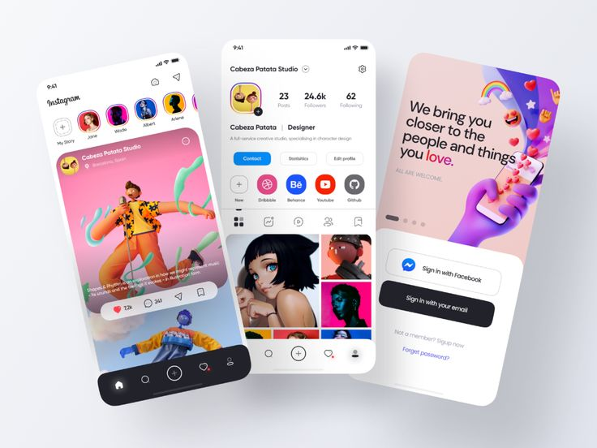
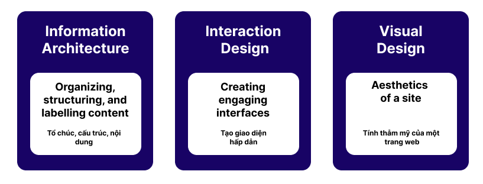
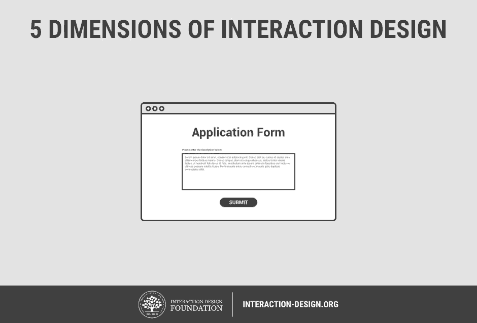
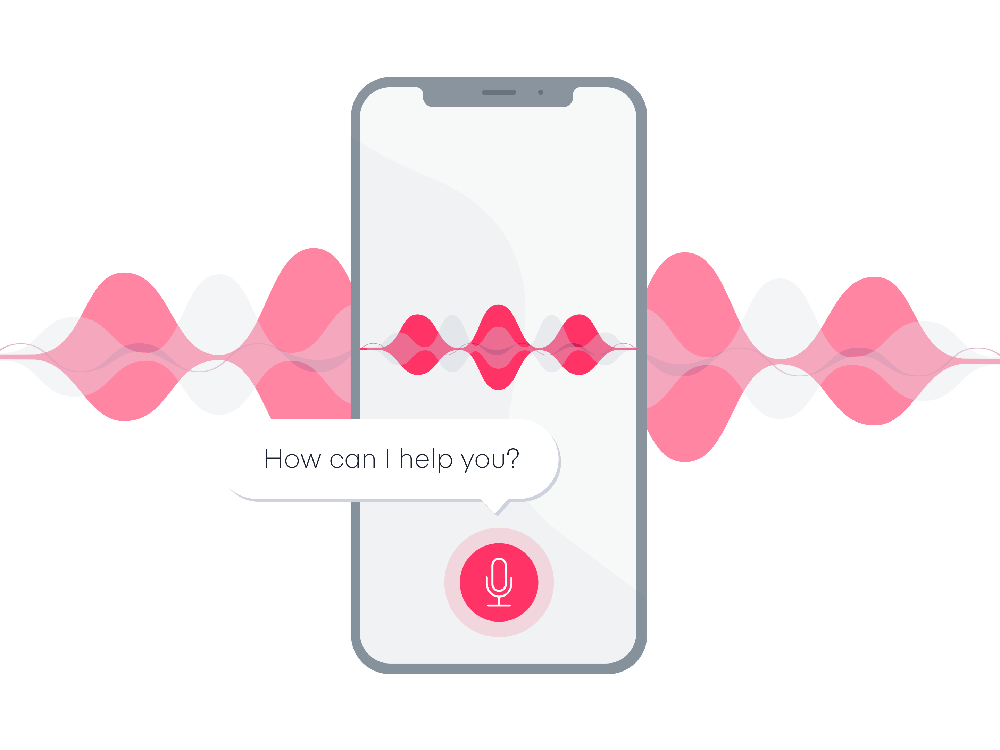
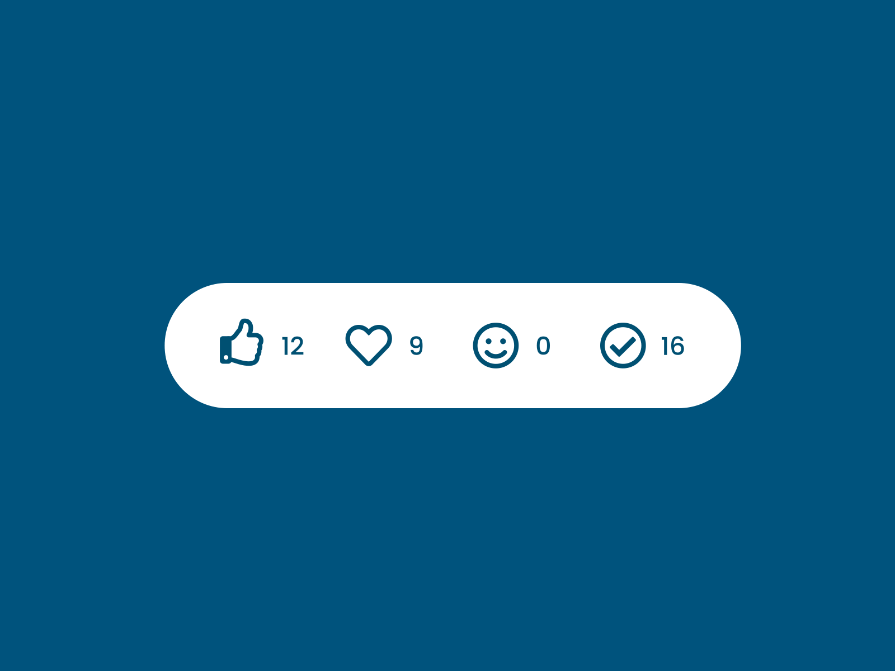
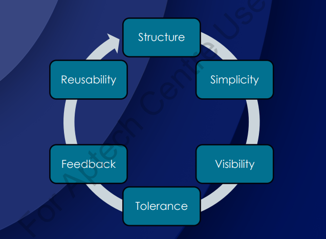

# Introduction to User Interface Design

## 💛 What is User Interface (UI)?

User Interface (UI) là giao diện người dùng, nghĩa là phần mà người dùng tương tác với một hệ thống hoặc ứng dụng. Nó đại diện cho tất cả các yếu tố mà người dùng có thể nhìn thấy, tương tác và sử dụng để thao tác với hệ thống đó.

UI bao gồm các thành phần như các nút bấm, ô nhập liệu, menu, thanh công cụ, hình ảnh, biểu đồ và các phần tử khác mà người dùng có thể tương tác trực tiếp. Mục đích chính của UI là cung cấp một cách tương tác dễ dàng và hiệu quả cho người dùng, giúp họ thực hiện các tác vụ và hoạt động trên hệ thống một cách thuận tiện.

Xem thêm: https://www.techtarget.com/searchapparchitecture/definition/user-interface-UI

## 💛 What is User Interface Design (UID)?

User Interface Design (Thiết kế giao diện người dùng) là quá trình tạo ra giao diện người dùng cho một hệ thống, ứng dụng hoặc sản phẩm. Nó liên quan đến việc thiết kế các yếu tố giao diện như cấu trúc, hình dạng, màu sắc, hình ảnh, văn bản và các phần tử tương tác khác để tạo ra một giao diện hấp dẫn, trực quan và dễ sử dụng cho người dùng.

(Mô tả giao diện giao tiếp giữa người dùng và Máy tính)

Mục tiêu của UID là làm cho trải nghiệm và tương tác của người dùng trở lên đơn giản và hiệu quả nhất.

Thành phần của UI-UX:

### 💥 Information Architecture

Information Architecture (IA) là quá trình thiết kế cấu trúc và tổ chức thông tin trong một hệ thống, ứng dụng, trang web hoặc giao diện người dùng. Nó tập trung vào việc xác định cách thông tin được tổ chức, đánh giá, hiển thị và tương tác để tạo ra một trải nghiệm người dùng tốt.

Nó tập trung diễn đặt vấn đề: Điều hướng, tổ chức bố cục, thành phần hiển thị. Mục tiêu làm sao cho người dùng trải nghiệm tốt nhất.

### 💥 Interaction Design

Interaction Design (ID) là quá trình thiết kế các yếu tố tương tác và trải nghiệm người dùng trong một hệ thống, ứng dụng hoặc sản phẩm. Nó tập trung vào việc xác định cách người dùng tương tác với giao diện và cung cấp trải nghiệm tốt nhất cho họ

5 khía cạnh của thiết kế tương tác

#### 🔹 Words - Từ ngữ

Từ ngữ – đặc biệt là những từ được sử dụng trong tương tác, như nhãn nút – phải có ý nghĩa, đơn giản và dễ hiểu. Chúng ta nên truyền đạt đủ và đúng thông tin cho người dùng, nhưng không quá nhiều thông tin để người dùng bị choáng ngợp.

#### 🔹 Visual Rep - Đại diện trực quan

Điều này liên quan đến các yếu tố đồ họa như hình ảnh, kiểu chữ và biểu tượng mà người dùng tương tác. Chúng thường bổ sung các từ được sử dụng để truyền đạt thông tin cho người dùng.

Nhìn vào cái biểu tượng thì người dùng hiểu ngay nó là gì, công năng sử dụng mà ko cần phải đi đọc hướng dẫn sử dụng.

#### 🔹 Object/Space - Đối tượng vật lý hoặc không gian

Người dùng tương tác với sản phẩm thông qua những đối tượng vật lý nào? Một máy tính xách tay, với một con chuột hoặc touchpad (bàn di chuột)? Hay một chiếc điện thoại thông minh, bằng ngón tay của người dùng? Và người dùng làm như vậy trong loại không gian vật lý nào? Ví dụ: người dùng đang đứng trong một đoàn tàu đông đúc trong khi sử dụng ứng dụng trên điện thoại thông minh hoặc đang ngồi trên bàn làm việc trong văn phòng để lướt trang web? Tất cả những điều này đều ảnh hưởng đến sự tương tác giữa người dùng và sản phẩm.

#### 🔹 Time - Thời gian

Mặc dù yếu tố thứ tư này nghe có vẻ hơi trừu tượng, nhưng nó chủ yếu đề cập đến các phương tiện thay đổi theo thời gian (hoạt ảnh, video, âm thanh). Chuyển động và âm thanh đóng một vai trò quan trọng trong việc đưa ra phản hồi bằng hình ảnh và âm thanh cho các tương tác của người dùng. Một vấn đề đáng quan tâm nữa là lượng thời gian người dùng dành để tương tác với sản phẩm: người dùng có thể theo dõi tiến trình của họ hoặc tiếp tục tương tác một thời gian sau không?

Bạn thấy rất nhiều trong các app học tiếng anh.

- Âm thanh khi làm đúng
- Âm thanh khi làm sai
- Hiệu ứng khi làm đúng, sai...

#### 🔹 Behavior - Hành vi

Điều này bao gồm cơ chế của một sản phẩm: làm thế nào để người dùng thực hiện các hành động trên trang web? Người dùng vận hành sản phẩm như thế nào? Nói cách khác, đó là cách các thứ nguyên trước đó xác định các tương tác của một sản phẩm. Hành vi cũng bao gồm các phản ứng, ví dụ: phản hồi hoặc hồi âm về cảm xúc của người dùng và sản phẩm.

### 💥 Visual Design  

Visual Design là quá trình tạo ra một giao diện hoặc trình bày hình ảnh hấp dẫn, trực quan và thẩm mỹ. Nó liên quan đến việc sắp xếp các yếu tố hình ảnh và màu sắc để tạo ra một trải nghiệm hình ảnh đồ họa tốt nhất và gửi thông điệp một cách hiệu quả.

Visual Design bao gồm các yếu tố sau:

1. Màu sắc: Lựa chọn màu sắc phù hợp để thể hiện thông điệp và tạo ra một thẩm mỹ hài hòa. Màu sắc có thể tạo ra sự tương phản, tạo điểm nhấn và tạo cảm xúc cho người xem.

2. Đồ họa: Sử dụng hình ảnh, biểu đồ, biểu đồ, biểu đồ, biểu đồ và các yếu tố hình ảnh khác để truyền đạt ý tưởng, thông tin và tạo ra sự hấp dẫn. Đồ họa có thể được sử dụng để tạo ra các yếu tố như logo, biểu ngữ, hình ảnh nền và biểu đồ.

3. Kiểu chữ: Lựa chọn phông chữ phù hợp để tạo ra một hình ảnh chữ viết đồng nhất và phù hợp với thông điệp và phong cách tổng thể. Kiểu chữ có thể tạo ra cảm giác chuyên nghiệp, thân thiện, truyền cảm hứng hoặc nổi bật.

4. Bố cục: Sắp xếp các yếu tố hình ảnh và văn bản một cách hợp lý trong không gian để tạo ra một giao diện hoặc trình bày hấp dẫn và dễ đọc. Bố cục cũng tạo ra sự cân đối, sự cân đối và sự tổ chức cho các yếu tố trong bức tranh tổng thể.

5. Hiệu ứng hình ảnh: Sử dụng các hiệu ứng hình ảnh như ánh sáng, mờ, đổ bóng, độ sáng và độ tương phản để tạo ra sự thú vị và tạo ra sự chuyển động trong hình ảnh.

---

Visual Design phù hợp cho từng loại đối tượng

- Người già
- Trẻ em

Visual Design phù hợp cho từng loại hình dịch vụ

- Bất động sản
- Chính phủ
- Game
- Xem Phim
- Mua sắm

---

## 💛 Parts of User Interface Design?

### 💥 Input Controls

- Button
- Radio
- Checkbox
- Select
- Input

### 💥 Navigation Components

- Search field
- Breadcrumb
- Pagination
- Tags
- Icons
- Image Carousel

### 💥 Information Components

- Tooltip
- Notification
- Process bar
- Message box
- Modal (Popup)

### 💥 Containers

- Accordion

---

## 💛 Dialogues/Principles and Attributes of User Interface Design

Những nguyên tắc trong thiết kế UI (UI Principles)

### **💥 Structure (Cấu trúc)**

#### **Ý nghĩa:**
- Giao diện cần tổ chức hợp lý, dễ hiểu và trực quan để người dùng dễ dàng tìm thấy thông tin hoặc chức năng cần thiết.

#### **Nguyên tắc chính:**
- **Phân cấp thông tin (Hierarchy):** Sắp xếp nội dung theo thứ tự quan trọng, giúp người dùng nhận biết được các yếu tố cần chú ý trước tiên.
- **Nhóm nội dung liên quan:** Đặt các yếu tố có liên quan gần nhau để tạo sự kết nối trực quan.
- **Định hướng rõ ràng:** Đảm bảo luồng tương tác logic, không gây nhầm lẫn.

#### **Ví dụ:**
- Trên một trang web thương mại điện tử, menu điều hướng ở đầu trang (header), sản phẩm nổi bật ở giữa, và thông tin liên hệ hoặc hỗ trợ ở chân trang (footer).

---

### **💥 Simplicity (Đơn giản)**

#### **Ý nghĩa:**
- Một giao diện đơn giản giúp người dùng tập trung vào các nhiệm vụ chính mà không bị phân tâm bởi các yếu tố không cần thiết.

#### **Nguyên tắc chính:**
- **Loại bỏ sự dư thừa:** Loại bỏ các yếu tố không quan trọng hoặc không có giá trị cho mục tiêu của người dùng.
- **Dễ hiểu:** Sử dụng ngôn ngữ và biểu tượng quen thuộc để giảm gánh nặng nhận thức.
- **Tối ưu thiết kế:** Tận dụng không gian trắng (white space) để giao diện thoáng đãng và dễ nhìn.

#### **Ví dụ:**
- Trang Google Search chỉ bao gồm một thanh tìm kiếm ở trung tâm, giúp người dùng tập trung vào chức năng chính.

---

### **💥 Visibility (Hiển thị)**

#### **Ý nghĩa:**
- Giao diện phải làm nổi bật các yếu tố quan trọng và đảm bảo mọi thông tin hoặc hành động có sẵn đều dễ dàng nhận thấy.

#### **Nguyên tắc chính:**
- **Nổi bật các yếu tố quan trọng:** Ví dụ, sử dụng màu sắc hoặc kích thước để làm nổi bật nút Call to Action (CTA).
- **Hiển thị trạng thái hệ thống:** Thông báo rõ ràng khi đang tải, lưu hoặc xử lý yêu cầu của người dùng.
- **Đảm bảo tính khả dụng:** Không để các chức năng quan trọng bị ẩn sâu hoặc khó tìm.

#### **Ví dụ:**
- Trạng thái nút "Submit" chuyển từ xám (không khả dụng) sang xanh khi người dùng hoàn thành biểu mẫu.

---

### **💥 Feedback (Phản hồi)**

#### **Ý nghĩa:**
- Giao diện cần cung cấp phản hồi tức thì để người dùng biết hệ thống đã nhận và xử lý hành động của họ.

#### **Nguyên tắc chính:**
- **Phản hồi trực quan:** Sử dụng hiệu ứng (như thay đổi màu sắc, rung nhẹ) khi người dùng nhấn nút.
- **Thông báo rõ ràng:** Hiển thị thông báo khi có lỗi hoặc hành động thành công.
- **Đồng bộ thời gian thực:** Phản hồi nhanh chóng để tránh làm gián đoạn trải nghiệm.

#### **Ví dụ:**
- Khi người dùng nhập mật khẩu sai, một thông báo lỗi màu đỏ xuất hiện ngay bên dưới trường nhập liệu.

---

### **💥 Tolerance (Khoan dung)**

#### **Ý nghĩa:**
- Giao diện phải linh hoạt và giúp người dùng sửa lỗi dễ dàng, thay vì trừng phạt họ vì những sai sót nhỏ.

#### **Nguyên tắc chính:**
- **Xử lý lỗi nhẹ nhàng:** Cung cấp thông báo lỗi thân thiện và hướng dẫn cách khắc phục.
- **Phòng ngừa lỗi:** Thêm xác nhận hoặc cảnh báo trước khi thực hiện hành động không thể hoàn tác.
- **Khôi phục dễ dàng:** Cho phép người dùng quay lại bước trước hoặc hoàn tác (undo).

#### **Ví dụ:**
- Gmail cung cấp tùy chọn "Undo Send" cho phép người dùng hủy gửi email ngay sau khi nhấn "Send".

---

### **💥 Reuse (Tái sử dụng)**

#### **Ý nghĩa:**
- Sử dụng các yếu tố giao diện quen thuộc và nhất quán để giảm gánh nặng nhận thức và tăng hiệu quả sử dụng.

#### **Nguyên tắc chính:**
- **Tính nhất quán:** Duy trì cùng một kiểu dáng, hành vi cho các thành phần UI trên toàn bộ sản phẩm.
- **Tận dụng mô hình quen thuộc:** Sử dụng các thành phần đã được người dùng biết đến và hiểu rõ, như nút, biểu tượng, hoặc menu.
- **Thư viện và mẫu thiết kế:** Tận dụng các hệ thống thiết kế (design system) để đảm bảo tái sử dụng các yếu tố một cách đồng nhất.

#### **Ví dụ:**
- Các nút "Lưu", "Xóa", hoặc "Chỉnh sửa" sử dụng biểu tượng và màu sắc quen thuộc trên toàn bộ hệ thống.

---

Bạn có thể search với keyword: `Principles User Interface Design` để tìm hiểu rõ hơn về khái niệm này.

---

## 💛 Types of User Interfaces

Các loại hình UI

### 💥 command line interface (CLI)

Command Line Interface (CLI) là một hình thức giao diện người dùng cho phép người dùng tương tác với hệ thống, ứng dụng hoặc thiết bị thông qua việc nhập lệnh văn bản vào dòng lệnh hoặc cửa sổ dòng lệnh. Trong CLI, người dùng phải gõ các lệnh và tham số liên quan để thực hiện các tác vụ và hoạt động

#### 🔹 Command Language-based Interface

- Giao diện sử dụng dòng lệnh bằng chữ
- Ví dụ Ms DOS, Commanline, Terminal

#### 🔹 Menu-based Interface

- Người dùng truy cập thông qua menu lệnh
- Ví dụ: Điện thoại cục gạch

#### 🔹 Natural Language Interface

- Người dùng giao tiếp với hệ thống thông qua ngôn ngữ nói
- Ví dụ: Trợ lý ảo

#### 🔹 Touch Sensitive Interface

- Người dùng giao tiếp bằng màn hình cảm ứng bằng cách CHẠM
- Ví dụ: SmartPhone, máy POS

#### 🔹 Web-based Interface

- Người dùng truy cập thông qua ứng dụng web, sử dụng phím và chuột

### 💥 graphical user interface (GUI)

Graphical User Interface (GUI) là một hình thức giao diện người dùng sử dụng hình ảnh đồ họa và các phần tử tương tác để tương tác với một hệ thống, ứng dụng hoặc thiết bị điện tử. Nó cung cấp một giao diện đồ họa dễ sử dụng và trực quan cho người dùng, cho phép họ thao tác và tương tác với các chức năng và tính năng của hệ thống thông qua các phần tử hình ảnh và điều khiển.

GUI bao gồm các yếu tố sau:

1. Cửa sổ: Hệ thống GUI chia màn hình thành các cửa sổ riêng biệt, mỗi cửa sổ chứa nội dung hoặc chức năng cụ thể. Các cửa sổ có thể được di chuyển, thay đổi kích thước và xếp chồng lên nhau.

2. Đồ họa: GUI sử dụng các yếu tố hình ảnh, biểu đồ, biểu đồ và biểu đồ để hiển thị thông tin và truyền đạt ý nghĩa cho người dùng. Đồ họa giúp tạo ra một giao diện trực quan và hấp dẫn.

3. Các điều khiển: GUI cung cấp các điều khiển tương tác như nút bấm, hộp chọn, ô nhập liệu, thanh trượt và menu để người dùng có thể tương tác và thực hiện các hành động.

4. Hình ảnh: GUI sử dụng hình ảnh và biểu tượng để đại diện cho các chức năng, tác vụ và đối tượng. Sử dụng các biểu tượng giúp người dùng dễ dàng nhận biết và hiểu các chức năng và hành động một cách nhanh chóng.

5. Đa phương tiện: GUI hỗ trợ hiển thị và phát lại nội dung đa phương tiện như hình ảnh, âm thanh và video. Điều này cho phép người dùng trải nghiệm các nội dung đa phương tiện trực quan và tương tác.

GUI ==> Giao diện trực quan

---

## 💛 Processes in User Interface Design

### 💥 Step 1 - Interface Analysis

Phân tích giao diện

### 💥 Step 2 - Interface Design

Phân tích thiết kế

### 💥 Step 3 - Interface Construction / Implementation

Xây dựng / Triển khai giao diện

### 💥 Step 4 - Interface Evaluation

Đánh giá giao diện

---

Trong thiết kế giao diện người dùng (UI), các mô hình đóng vai trò quan trọng trong việc hiểu, xây dựng và triển khai một sản phẩm hoặc giao diện hiệu quả. Dưới đây là chi tiết về từng loại mô hình:

---

### **💥 User Model (Mô hình người dùng)**

#### **Ý nghĩa:**
- Mô hình người dùng đại diện cho cách **người dùng thực sự tương tác** với hệ thống. Nó phản ánh các nhu cầu, mục tiêu, hành vi và khả năng của người dùng.

#### **Đặc điểm:**
- Xây dựng dựa trên nghiên cứu người dùng như phỏng vấn, khảo sát, hoặc phân tích hành vi.
- Bao gồm các yếu tố như:  
  - **Mục tiêu:** Người dùng muốn đạt được gì khi sử dụng sản phẩm?  
  - **Nhiệm vụ:** Các bước người dùng thực hiện để đạt mục tiêu.  
  - **Kỹ năng:** Trình độ công nghệ của người dùng (cơ bản, trung cấp, nâng cao).  

#### **Ứng dụng:**
- Đảm bảo thiết kế đáp ứng đúng nhu cầu và mong đợi của đối tượng mục tiêu.
- Xác định các điểm khó khăn hoặc mâu thuẫn trong hành trình người dùng (user journey).

#### **Ví dụ:**
- Một ứng dụng đặt vé máy bay trực tuyến phải dễ dàng sử dụng cho cả người dùng không quen thuộc với công nghệ, chẳng hạn hiển thị bước đặt vé một cách trực quan (tìm chuyến bay -> chọn vé -> thanh toán).

---

### **💥 Mental Model (Mô hình tư duy)**

#### **Ý nghĩa:**
- Mô hình tư duy là cách **người dùng hình dung** hoặc **kỳ vọng** hệ thống hoạt động dựa trên kinh nghiệm, hiểu biết, hoặc bối cảnh của họ.

#### **Đặc điểm:**
- **Dựa trên trải nghiệm trước đây:** Người dùng thường so sánh hệ thống mới với những gì họ đã quen thuộc.  
- **Không nhất quán:** Mỗi người dùng có thể có mô hình tư duy khác nhau, tùy thuộc vào kinh nghiệm cá nhân.  
- **Đơn giản hóa:** Mô hình tư duy thường không phản ánh chính xác cách hệ thống thực sự hoạt động.

#### **Ứng dụng:**
- Thiết kế giao diện theo cách dễ hiểu nhất, phù hợp với kỳ vọng của người dùng.
- Xây dựng các thành phần giao diện giống với các mô hình quen thuộc, chẳng hạn biểu tượng thùng rác cho hành động xóa.

#### **Ví dụ:**
- Trong một ứng dụng email, người dùng kỳ vọng **thư đã xóa** sẽ nằm trong "Trash" và có thể khôi phục. Đây là một phần của mô hình tư duy phổ biến.

---

### **💥 Design Model (Mô hình thiết kế)**

#### **Ý nghĩa:**
- Mô hình thiết kế đại diện cho **cách nhà thiết kế hình dung** hệ thống sẽ hoạt động và cách nó thể hiện ý định với người dùng.

#### **Đặc điểm:**
- Tập trung vào **cách hệ thống nên được trình bày** để người dùng hiểu và tương tác dễ dàng.
- Bao gồm các yếu tố như:  
  - **Tổ chức thông tin:** Cách sắp xếp dữ liệu, thông tin trong giao diện.  
  - **Cấu trúc giao diện:** Bố cục, màu sắc, và phong cách thị giác.  
  - **Tương tác:** Hành động và phản hồi của hệ thống với người dùng.

#### **Ứng dụng:**
- Là cầu nối giữa **mô hình tư duy của người dùng** và **mô hình triển khai thực tế**.
- Đảm bảo giao diện không chỉ đẹp mắt mà còn trực quan và dễ sử dụng.

#### **Ví dụ:**
- Giao diện của một trang web thương mại điện tử có menu điều hướng rõ ràng, ảnh sản phẩm lớn, và nút "Add to Cart" dễ nhận biết để dẫn dắt hành vi người dùng.

---

### **💥 Implementation Model (Mô hình triển khai)**

#### **Ý nghĩa:**
- Mô hình triển khai thể hiện **cách hệ thống thực sự hoạt động** ở mức kỹ thuật hoặc logic. Đây là cách hệ thống được các nhà phát triển xây dựng và triển khai.

#### **Đặc điểm:**
- Tập trung vào các khía cạnh kỹ thuật: cơ sở dữ liệu, logic xử lý, cấu trúc mã nguồn.
- Người dùng không trực tiếp nhìn thấy hoặc hiểu mô hình này.
- Có thể phức tạp và không đồng nhất với mô hình tư duy của người dùng hoặc thiết kế.

#### **Ứng dụng:**
- Đảm bảo hệ thống hoạt động đúng như dự kiến của nhà thiết kế.
- Hỗ trợ đội ngũ kỹ thuật trong việc triển khai các tính năng mà người dùng mong muốn.

#### **Ví dụ:**
- Khi người dùng nhấn nút "Đặt hàng", hệ thống gửi thông tin đến máy chủ, lưu dữ liệu vào cơ sở dữ liệu, và trả về thông báo "Đặt hàng thành công" – tất cả các bước này thuộc về mô hình triển khai.

---

### **Sự liên kết giữa các mô hình**
| **Mô hình**             | **Vai trò**                                                                                       | **Kết nối với mô hình khác**                                                                                                                                      |
|--------------------------|--------------------------------------------------------------------------------------------------|------------------------------------------------------------------------------------------------------------------------------------------------------------------|
| **User Model**           | Phản ánh hành vi và mong đợi thực tế của người dùng.                                             | Là cơ sở để thiết kế mô hình tư duy và mô hình thiết kế phù hợp với người dùng.                                                                                   |
| **Mental Model**         | Thể hiện cách người dùng hiểu và kỳ vọng về hệ thống.                                            | Cần được đồng bộ với mô hình thiết kế để đảm bảo trải nghiệm dễ hiểu và trực quan.                                                                               |
| **Design Model**         | Cách nhà thiết kế hình dung và thể hiện hệ thống.                                                | Đóng vai trò cầu nối giữa mô hình tư duy và mô hình triển khai.                                                                                                  |
| **Implementation Model** | Thể hiện cách hệ thống thực sự hoạt động ở cấp độ kỹ thuật.                                      | Phải đảm bảo thực hiện đúng ý định từ mô hình thiết kế để đồng bộ với kỳ vọng của người dùng.                                                                    |

---

Cả bốn mô hình phải được liên kết chặt chẽ để đảm bảo hệ thống không chỉ hoạt động hiệu quả mà còn mang lại trải nghiệm tốt nhất cho người dùng.

---

## 💛 Principles of Mobile User Interface Design

Những nguyên tắc thiết kế giao diện Mobile

1. Content-First Approach: Tiếp cận nội dung đầu tiên
2. Importance of Fullscreen: Tầm quan trọng của việc hiện thị FullScreen
3. Avoiding Clutter: Tránh sự lộn xộn
4. Creating the First Impression: Tạo ấn tượng đầu tiên
5. Focusing on User: Tập trung vào người dùng 
6. Using Color Psychology: Sử dụng màu sắc theo tâm lý người dùng
7. HighResolution Images: Hình ảnh có độ phân giải cao

---

## 💛 Color Theory

**Color Theory trong UI/UX** là tập hợp các nguyên tắc hướng dẫn việc sử dụng màu sắc trong thiết kế, nhằm tạo ra trải nghiệm trực quan hiệu quả, hấp dẫn và nhất quán. Nó ảnh hưởng trực tiếp đến cảm xúc, hành vi của người dùng và khả năng tương tác với giao diện. Dưới đây là những yếu tố cơ bản của Color Theory và cách ứng dụng trong UI/UX:

**Color Theory** trong UI/UX là tập hợp các nguyên tắc hướng dẫn việc sử dụng màu sắc trong thiết kế, nhằm tạo ra trải nghiệm trực quan hiệu quả, hấp dẫn và nhất quán. Nó ảnh hưởng trực tiếp đến cảm xúc, hành vi của người dùng và khả năng tương tác với giao diện. Dưới đây là những yếu tố cơ bản của **Color Theory** và cách ứng dụng trong UI/UX:

---

### **1. Nguyên lý cơ bản của Color Theory**
#### **Màu cơ bản (Primary Colors)**
- Đỏ, vàng, xanh dương là ba màu cơ bản không thể tạo ra từ các màu khác.
- Các màu khác được phối từ ba màu này.

#### **Màu thứ cấp (Secondary Colors)**
- Cam, xanh lá, tím được tạo ra từ việc pha trộn hai màu cơ bản.

#### **Màu bậc ba (Tertiary Colors)**
- Được tạo ra từ việc pha màu cơ bản với màu thứ cấp.

#### **Thuộc tính của màu sắc**
- **Hue**: Màu sắc chính (như đỏ, xanh).
- **Saturation**: Mức độ bão hòa, thể hiện sự rực rỡ hay nhạt nhòa của màu.
- **Brightness (Lightness)**: Độ sáng hoặc tối của màu sắc.

---

### **2. Nguyên tắc phối màu**
#### **Monochromatic (Đơn sắc)**
- Sử dụng các sắc thái, tông màu khác nhau của cùng một màu.
- **Ưu điểm**: Tạo sự thống nhất, nhẹ nhàng.
- **Ứng dụng**: Giao diện tối giản.

#### **Analogous (Tương tự)**
- Sử dụng ba màu liền kề trên bánh xe màu.
- **Ưu điểm**: Mềm mại, dễ chịu.
- **Ứng dụng**: Tạo sự hài hòa và tự nhiên.

#### **Complementary (Bổ sung)**
- Sử dụng hai màu đối xứng nhau trên bánh xe màu (ví dụ: xanh dương và cam).
- **Ưu điểm**: Tạo độ tương phản cao.
- **Ứng dụng**: Thu hút sự chú ý, nổi bật CTA (Call to Action).

#### **Triadic (Tam giác cân)**
- Sử dụng ba màu cách đều trên bánh xe màu.
- **Ưu điểm**: Cân bằng giữa sự sống động và hài hòa.
- **Ứng dụng**: Thiết kế vui tươi, trẻ trung.

#### **Split-Complementary (Bổ sung phân tách)**
- Chọn một màu chính và hai màu liền kề với màu bổ sung của nó.
- **Ưu điểm**: Ít gây căng thẳng hơn so với bổ sung trực tiếp.
- **Ứng dụng**: Dễ dàng kiểm soát sự tương phản.

---

**Color Theory** còn liên quan cách hiểu và áp dụng màu sắc trong các lĩnh vực khác nhau, từ nghệ thuật, thiết kế đến khoa học. Dưới đây là sự khác biệt và ứng dụng của chúng:

---

### **1. Traditional Color Theory (Lý thuyết màu sắc truyền thống)**

#### **Đặc điểm:**
- Dựa trên mô hình **RYB (Red, Yellow, Blue)** – ba màu cơ bản (primary colors) từ đó tạo ra tất cả các màu khác.
- Phổ biến trong hội họa và nghệ thuật thị giác.
- Hình thành trên thực tiễn pha trộn màu sắc từ chất liệu vật lý như sơn, mực.

#### **Ứng dụng:**
- Dùng trong giáo dục mỹ thuật cơ bản.
- Tạo ra bảng màu phù hợp cho các tác phẩm nghệ thuật.
- Áp dụng để phối màu truyền thống: bổ sung (Complementary), tương tự (Analogous), đơn sắc (Monochromatic).

#### **Hạn chế:**
- Dựa trên cảm nhận thị giác thay vì tính toán khoa học.  
- Không chính xác khi so sánh với cách con người thực sự cảm nhận ánh sáng và màu sắc.

---

### **2. Modern Color Theory (Lý thuyết màu sắc hiện đại)**

#### **Đặc điểm:**
- Dựa trên khoa học và cách mắt người xử lý ánh sáng, tập trung vào mô hình **RGB (Red, Green, Blue)**.
- Mô hình RGB: Màu ánh sáng (additive color system), khi kết hợp sẽ tạo ra màu trắng.
- Bao gồm cả mô hình **CMYK (Cyan, Magenta, Yellow, Black)** cho màu in (subtractive color system).

#### **Ứng dụng:**
- Dùng trong các công nghệ kỹ thuật số (màn hình, thiết bị điện tử).
- Thiết kế giao diện người dùng (UI), đồ họa số, và hình ảnh trên web.
- Áp dụng cho in ấn với CMYK.

#### **Ưu điểm:**
- Phản ánh chính xác cách ánh sáng tương tác với mắt người.
- Dễ dàng điều chỉnh màu sắc khi làm việc với công nghệ.

---

### **3. Subtractive Theory (Lý thuyết màu sắc trừ)**

#### **Đặc điểm:**
- Mô hình **CMY (Cyan, Magenta, Yellow)** là cơ bản, bổ sung thêm **K (Black)** để tạo màu đen và cải thiện độ sâu.
- Hoạt động trên nguyên tắc ánh sáng bị hấp thụ hoặc phản chiếu khi chiếu vào vật thể.  
  - Khi trộn các màu (CMY), ánh sáng phản chiếu bị giảm, tạo ra màu mới.
- Được sử dụng trong các phương pháp in ấn truyền thống và hiện đại.

#### **Ứng dụng:**
- Thiết kế đồ họa in ấn (tạp chí, sách, bao bì).
- Áp dụng khi làm việc với chất liệu vật lý (giấy, vải, mực).

#### **Hạn chế:**
- Không thể tái tạo màu sắc rực rỡ như hệ RGB.  
- Đòi hỏi sự kiểm soát tốt về màu mực và ánh sáng môi trường.

---

### **So sánh và Mối quan hệ**
| **Khía cạnh**         | **Traditional Color Theory** | **Modern Color Theory** | **Subtractive Theory** |
|------------------------|-----------------------------|--------------------------|-------------------------|
| **Mô hình cơ bản**     | RYB (Đỏ, Vàng, Xanh lam)   | RGB (Đỏ, Xanh lá, Xanh lam) | CMY (Lục lam, Đỏ tươi, Vàng) |
| **Nguyên lý**          | Pha trộn sơn hoặc mực truyền thống | Ánh sáng cộng (Additive) | Ánh sáng trừ (Subtractive) |
| **Ứng dụng chính**     | Nghệ thuật, hội họa         | Công nghệ kỹ thuật số    | In ấn, sản phẩm vật lý  |
| **Kết hợp màu**        | Tạo màu tối hơn khi pha trộn | Tạo màu sáng hơn khi cộng ánh sáng | Tạo màu tối hơn khi trộn vật liệu |

---

Việc chọn lý thuyết phù hợp phụ thuộc vào mục tiêu cụ thể của dự án và môi trường ứng dụng (kỹ thuật số hay vật lý).

### **Tâm lý màu sắc trong UI/UX**
Màu sắc ảnh hưởng đến cảm xúc và hành vi của người dùng. Một số ý nghĩa tâm lý thường thấy:
- **Đỏ**: Tạo cảm giác khẩn cấp, năng lượng, đam mê (dùng cho cảnh báo, CTA).
- **Xanh dương**: Độ tin cậy, bình yên, chuyên nghiệp (dùng trong ngành tài chính, công nghệ).
- **Vàng**: Sự ấm áp, hạnh phúc, lạc quan (thu hút ánh nhìn, tạo điểm nhấn).
- **Xanh lá**: Tự nhiên, tươi mới, sức khỏe (thường liên quan đến môi trường, sức khỏe).
- **Tím**: Sáng tạo, cao cấp, huyền bí (phù hợp với lĩnh vực nghệ thuật, làm đẹp).
- **Cam**: Thân thiện, sáng tạo, nhiệt huyết (dùng để thu hút nhưng không áp đảo).
- **Đen**: Sang trọng, quyền lực, tối giản (dành cho thương hiệu cao cấp).
- **Trắng**: Sạch sẽ, tối giản, chuyên nghiệp (tạo không gian thoáng và dễ đọc).

---

Tham khảo:

- https://www.w3schools.com/colors/colors_theory.asp
- https://www.interaction-design.org/literature/topics/color-theory#:~:text=Color%20theory%20is%20the%20study,right%20colors%20for%20their%20projects.

---

## 💛 Design Thinking

Design Thinking là một quy trình sáng tạo, lấy con người làm trung tâm, thường được áp dụng trong thiết kế UI/UX để giải quyết các vấn đề phức tạp một cách sáng tạo và hiệu quả. Quy trình này bao gồm năm bước chính: **Empathize, Define, Ideate, Prototype, và Test**. Mỗi bước đều đóng vai trò quan trọng trong việc phát triển giải pháp đáp ứng nhu cầu người dùng. Đây là lý do tại sao quy trình này được sử dụng:

---

### 💥 **1. Empathize (Thấu cảm)**
- **Mục tiêu**: Hiểu sâu sắc về người dùng, nhu cầu, mong muốn, và vấn đề họ đang gặp phải.
- **Vai trò trong UI/UX**:  
  - Thu thập thông tin thực tế từ người dùng thông qua phỏng vấn, khảo sát, quan sát.
  - Giúp nhà thiết kế thoát khỏi những giả định chủ quan để tập trung vào trải nghiệm thật của người dùng.

---

### 💥 **2. Define (Xác định vấn đề)**
- **Mục tiêu**: Xác định rõ ràng vấn đề cần giải quyết dựa trên dữ liệu từ bước Empathize.
- **Vai trò trong UI/UX**:  
  - Tổng hợp insight từ người dùng để xác định vấn đề trọng tâm.  
  - Tạo ra một tuyên bố vấn đề (problem statement) cụ thể, làm cơ sở cho thiết kế.

---

### 💥 **3. Ideate (Tạo ý tưởng)**
- **Mục tiêu**: Tạo ra nhiều ý tưởng sáng tạo để giải quyết vấn đề.
- **Vai trò trong UI/UX**:  
  - Khuyến khích tư duy sáng tạo và tự do, giúp đưa ra các giải pháp đa dạng.  
  - Dùng các phương pháp như brainstorming, mind mapping để tìm giải pháp khác biệt.

---

### 💥 **4. Prototype (Tạo mẫu)**
- **Mục tiêu**: Xây dựng phiên bản thử nghiệm của giải pháp.
- **Vai trò trong UI/UX**:  
  - Thiết kế wireframes, mockups, hoặc các mẫu thử (low-fidelity hoặc high-fidelity) để trực quan hóa giải pháp.  
  - Giúp thu thập phản hồi ban đầu trước khi đầu tư quá nhiều thời gian và chi phí vào sản phẩm hoàn chỉnh.

---

### 💥 **5. Test (Kiểm tra)**
- **Mục tiêu**: Đánh giá tính hiệu quả của giải pháp thông qua thử nghiệm thực tế.
- **Vai trò trong UI/UX**:  
  - Thu thập phản hồi từ người dùng về prototype.  
  - Phát hiện các vấn đề hoặc cơ hội cải thiện trước khi triển khai sản phẩm chính thức.

---

### **Lý do quy trình này hiệu quả trong UI/UX**
1. **Lấy người dùng làm trung tâm**: Mọi quyết định đều xoay quanh nhu cầu và trải nghiệm của người dùng.
2. **Tính lặp lại**: Kết quả từ bước Test có thể đưa nhà thiết kế quay lại các bước trước đó (ví dụ: Ideate hoặc Prototype) để cải thiện.
3. **Tích hợp sáng tạo và logic**: Quy trình vừa khuyến khích tư duy sáng tạo (Ideate), vừa đảm bảo tính thực tiễn (Test).
4. **Giảm rủi ro**: Sử dụng prototype giúp tiết kiệm chi phí và thời gian bằng cách phát hiện lỗi sớm.

Quy trình này không chỉ giúp tạo ra sản phẩm tốt hơn mà còn đảm bảo rằng sản phẩm thực sự giải quyết được vấn đề mà người dùng quan tâm.

---

## 💛 Best Practices in UI Design

### **💥 Consistency - Tính nhất quán**

#### **Ý nghĩa:**
- Sự nhất quán đảm bảo rằng giao diện có cùng một phong cách, cách hoạt động và quy tắc trên toàn bộ hệ thống, giúp người dùng dễ dàng sử dụng mà không cần học lại.

#### **Cách thực hiện:**
1. **Nhất quán về giao diện (Visual Consistency):**  
   - Dùng cùng một bảng màu, kiểu chữ, kích thước nút trên toàn bộ ứng dụng.  
2. **Nhất quán về hành vi (Behavioral Consistency):**  
   - Các nút hoặc thao tác tương tự phải hoạt động giống nhau trên toàn hệ thống.  
3. **Nhất quán về ngôn ngữ:**  
   - Dùng từ ngữ và biểu tượng quen thuộc, đồng nhất để mô tả chức năng.

#### **Ví dụ:**
- Facebook sử dụng biểu tượng "Like" (👍) và màu xanh nhất quán trên mọi giao diện để biểu thị đồng tình hoặc yêu thích.

---

### **💥 Patterns - Khuôn mẫu**

#### **Ý nghĩa:**
- Khuôn mẫu là các thiết kế chuẩn hoặc đã được sử dụng rộng rãi, giúp người dùng nhanh chóng nhận biết cách tương tác với hệ thống.

#### **Cách thực hiện:**
1. **Áp dụng các khuôn mẫu quen thuộc:**  
   - Sử dụng các mẫu giao diện phổ biến như header, footer, sidebar.  
2. **Giữ quy tắc UX/UI chuẩn:**  
   - Ví dụ: Thanh điều hướng nên ở phía trên hoặc bên trái vì người dùng đã quen thuộc với cách này.  
3. **Tận dụng thư viện giao diện:**  
   - Sử dụng các framework UI/UX như Material Design (Google) hoặc Human Interface Guidelines (Apple).

#### **Ví dụ:**
- Các trang thương mại điện tử thường sử dụng mẫu tìm kiếm (search bar) ở trên cùng và giỏ hàng (cart) ở góc phải trên.

---

### **💥 Visual Hierarchy - Phân cấp trực quan**

#### **Ý nghĩa:**
- Phân cấp trực quan giúp người dùng hiểu được mức độ quan trọng của từng thành phần trong giao diện, từ đó dẫn dắt sự chú ý và hành vi của họ.

#### **Cách thực hiện:**
1. **Sử dụng kích thước:**  
   - Nội dung quan trọng nên lớn hơn, nổi bật hơn.  
2. **Tạo sự tương phản:**  
   - Dùng màu sắc, độ sáng, hoặc phong cách chữ để làm nổi bật yếu tố cần nhấn mạnh.  
3. **Sắp xếp theo quy luật thị giác:**  
   - Người dùng thường đọc từ trên xuống dưới, từ trái qua phải (trong văn hóa phương Tây). Sắp xếp nội dung theo thứ tự này.

#### **Ví dụ:**
- Trang chủ của Apple: Tiêu đề sản phẩm lớn, hình ảnh rõ ràng, và nút "Buy" nổi bật giúp người dùng nhanh chóng tập trung vào sản phẩm mới.

---

### **💥 User Control - Kiểm soát người dùng**

#### **Ý nghĩa:**
- Giao diện cần trao quyền kiểm soát cho người dùng, cho phép họ tự do thực hiện hành động và sửa lỗi nếu cần.

#### **Cách thực hiện:**
1. **Cung cấp các tùy chọn rõ ràng:**  
   - Người dùng cần biết họ đang ở đâu và có thể làm gì tiếp theo.  
2. **Cho phép hoàn tác:**  
   - Luôn cung cấp tính năng Undo/Redo để giảm rủi ro từ lỗi không mong muốn.  
3. **Đưa ra cảnh báo:**  
   - Xác nhận trước khi thực hiện các hành động không thể hoàn tác, ví dụ xóa dữ liệu.  

#### **Ví dụ:**
- Gmail có tùy chọn "Undo Send" cho phép người dùng thu hồi email vừa gửi.

---

