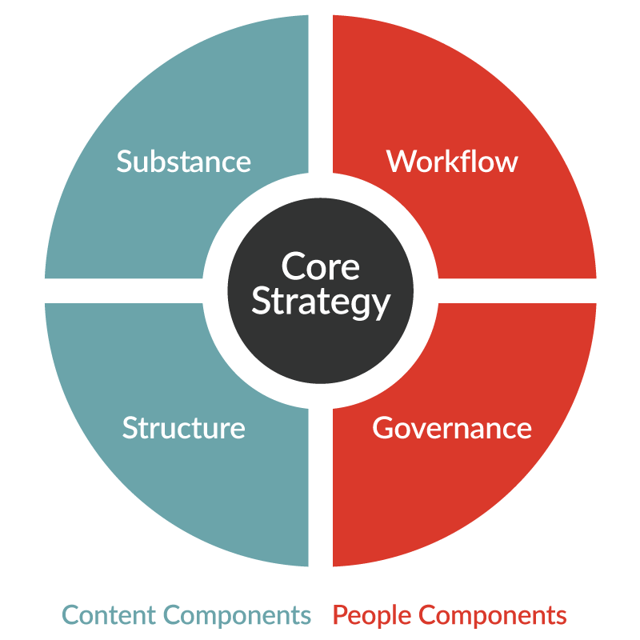

# Understanding Strategies for Responsive Web Design

## 💛 Strategies for RWD in Various Devices

Chiến lược cho việc RWD trên nhiều thiết bị khác nhau

### 💥 1. Identifying breakpoints

Xác định các điểm breakpoints hỗ trợ

### 💥 2. Lowering page load time

Giảm thời gian tải trang

### 💥 3. Optimizing image size

Tối ưu hóa kích thước hình ảnh

- Hình ảnh vừa đủ để hiển thị tại ví trí đó
- Nén hình tới mức vừa đủ chất lượng để hiển thị, để có dung lượng nhẹ nhất có thể.

### 💥 4. Mobile First

Ưu tiên mobile trước

### 💥 5. Research First

**Research first** (nghiên cứu trước) là một phương pháp tiếp cận trong đó nhà phát triển hoặc nhà thiết kế sẽ tiến hành nghiên cứu kỹ lưỡng trước khi bắt đầu quá trình thiết kế.

Nghiên cứu này có thể bao gồm việc tìm hiểu về người dùng mục tiêu, công nghệ họ sử dụng, cách họ tương tác với website hoặc ứng dụng, và các yếu tố khác có thể ảnh hưởng đến trải nghiệm của họ. Thông tin thu được từ quá trình nghiên cứu này sau đó sẽ được sử dụng để hướng dẫn quá trình thiết kế, giúp đảm bảo rằng sản phẩm cuối cùng sẽ đáp ứng nhu cầu và kỳ vọng của người dùng một cách hiệu quả.

---

## 💛 What is Content Strategy?

Trọng tâm là chiến lược nội dung cốt lõi, cách tiếp cận bạn sẽ thực hiện với nội dung trang web, sản phẩm hoặc dịch vụ của mình để đáp ứng nhu cầu của người dùng và đạt được mục tiêu kinh doanh của bạn. Để đạt được chiến lược đó một cách hiệu quả nhất, chúng tôi xem xét bốn thành phần có liên quan chặt chẽ với nhau

### 💥 Content-focused components

Các thành phần tập trung vào nội dung

- Substance (Nội dung): Chúng ta cần loại nội dung nào (chủ đề, loại, nguồn, v.v.) và nội dung cần truyền tải thông điệp gì đến khán giả?
- Structure (Cấu trúc): Nội dung được ưu tiên, sắp xếp, định dạng và hiển thị như thế nào? (Cấu trúc có thể bao gồm lập kế hoạch truyền thông, IA, siêu dữ liệu, mô hình hóa dữ liệu, chiến lược liên kết, v.v.)

### 💥 People-focused components

Các thành phần tập trung vào con người

- Workflow (Quy trình làm việc): Cần có những quy trình, công cụ và nguồn nhân lực nào để các sáng kiến nội dung có thể triển khai thành công và duy trì chất lượng liên tục?
- Governance (Quản trị): Các quyết định quan trọng về nội dung và chiến lược nội dung được thực hiện như thế nào? Những thay đổi được bắt đầu và truyền đạt như thế nào?

## 💛 How Does Content Strategy Relate to UX Design?

Chiến lược nội dung liên quan đến thiết kế UX như thế nào ?

Xem thêm: https://uxmag.com/articles/content-strategy-and-ux-a-modern-love-story

**Content Strategy** và **UX Design** có mối liên hệ chặt chẽ, vì cả hai đều tập trung vào việc cung cấp trải nghiệm tốt nhất cho người dùng. Trong đó:

- **Content Strategy**: Tập trung vào việc lập kế hoạch, phát triển và quản lý nội dung (text, hình ảnh, video, v.v.) để đảm bảo rằng nội dung không chỉ phù hợp với mục tiêu kinh doanh mà còn đáp ứng nhu cầu người dùng.
- **UX Design**: Tập trung vào việc thiết kế các sản phẩm và giao diện mang lại trải nghiệm người dùng tối ưu, bao gồm cách bố trí giao diện, chức năng và cách các yếu tố tương tác.

#### 1. **Content Strategy hỗ trợ UX Design như thế nào?**
- **Cung cấp nội dung hữu ích và có ý nghĩa**: UX không chỉ là giao diện đẹp mà còn phụ thuộc vào nội dung. Chiến lược nội dung giúp xác định **thông điệp**, **ngữ điệu**, và **giá trị** mà người dùng sẽ nhận được.
- **Định hình luồng trải nghiệm người dùng**: Nội dung hướng dẫn người dùng trong các hành động và quyết định. Ví dụ: Nội dung trong call-to-action (CTA), hướng dẫn, hoặc thông báo lỗi đều tác động trực tiếp đến trải nghiệm.
- **Đảm bảo tính nhất quán**: Content Strategy thiết lập **ngữ điệu**, **phong cách** và **giọng nói thương hiệu** thống nhất trên toàn bộ trang web, điều này tạo nên trải nghiệm đồng bộ.

#### 2. **UX Design hỗ trợ Content Strategy như thế nào?**
- **Tạo môi trường trình bày nội dung hiệu quả**: UX Design giúp trình bày nội dung một cách rõ ràng, dễ tiếp cận và hấp dẫn qua việc bố trí giao diện, sử dụng không gian trắng (white space), và các yếu tố trực quan khác.
- **Tối ưu hóa khả năng tiếp cận nội dung**: UX Design đảm bảo nội dung dễ tìm thấy qua thanh điều hướng, bộ lọc, hoặc công cụ tìm kiếm.
- **Phản hồi từ người dùng**: UX Design sử dụng nghiên cứu người dùng để cung cấp thông tin chi tiết, giúp chiến lược nội dung điều chỉnh để phù hợp hơn với nhu cầu và mong muốn thực tế của người dùng.

#### 3. **Những yếu tố chung giữa Content Strategy và UX Design**
- **Tập trung vào người dùng**: Cả hai đều bắt đầu từ việc hiểu đối tượng mục tiêu thông qua nghiên cứu, từ đó đưa ra các quyết định thiết kế và nội dung dựa trên nhu cầu của người dùng.
- **Cộng tác đa chức năng**: UX Designers và Content Strategists cần làm việc chặt chẽ với nhau. Ví dụ, một nhà thiết kế UX có thể cần sự hỗ trợ để xác định nội dung nào cần xuất hiện trên giao diện.
- **Cân bằng giữa mục tiêu kinh doanh và trải nghiệm người dùng**: Content Strategy và UX Design cùng hướng tới việc đáp ứng mục tiêu của doanh nghiệp nhưng không làm giảm trải nghiệm người dùng.

#### 4. **Ví dụ thực tế**
- **E-commerce Website**: Nội dung (mô tả sản phẩm, CTA) cần được tối ưu hóa để giúp người dùng tìm thấy thông tin cần thiết và dễ dàng hoàn thành giao dịch. UX Design đảm bảo giao diện (layout, nút "Thêm vào giỏ hàng", thanh tìm kiếm) hỗ trợ nội dung một cách hiệu quả.
- **Ứng dụng giáo dục**: Nội dung hướng dẫn học tập (text, video) phải hấp dẫn và dễ tiếp cận. UX Design đảm bảo rằng nội dung này được trình bày trực quan, dễ sử dụng trên nhiều thiết bị khác nhau.

---

## 💛 What is Content Audit ?

Kiểm toán nội dung --> Test lại, review lại toàn bộ công việc đã làm.

Bằng cách lập kế hoạch thành file,

---

## 💛 Difference Between Responsive and Adaptive Website Designs

Cả **Responsive Design** và **Adaptive Design** đều nhằm đảm bảo trải nghiệm người dùng tốt trên các thiết bị khác nhau, nhưng cách tiếp cận của chúng khác nhau. Dưới đây là chi tiết về từng phương pháp:

### **Responsive Design**

Responsive Design (Thiết kế đáp ứng) là phương pháp trong đó giao diện website thay đổi linh hoạt dựa trên kích thước màn hình hoặc khung nhìn (viewport).  

#### **Đặc điểm chính:**
1. **Sử dụng grid linh hoạt:**  
   Sử dụng các grid (lưới) dựa trên phần trăm thay vì đơn vị cố định như pixel. Điều này cho phép các phần tử tự điều chỉnh kích thước theo tỷ lệ màn hình.

2. **Media Queries:**  
   Dựa vào các breakpoint được định nghĩa trong CSS để áp dụng các kiểu dáng (styles) khác nhau cho từng kích thước màn hình (ví dụ: màn hình điện thoại, máy tính bảng, máy tính để bàn).

3. **Cách tiếp cận:**  
   - Nội dung co giãn liên tục (fluid).
   - Một giao diện duy nhất hoạt động tốt trên mọi kích thước màn hình.  
     Ví dụ: Khi bạn thay đổi kích thước trình duyệt, bạn sẽ thấy website tự động thay đổi bố cục.

4. **Ưu điểm:**
   - Dễ quản lý: Một thiết kế duy nhất cho mọi thiết bị.
   - Thích ứng tốt với mọi màn hình, kể cả màn hình có kích thước không phổ biến.
   - Tốt cho SEO (Google ưu tiên các trang web responsive).

5. **Nhược điểm:**
   - Có thể phức tạp hơn về mặt kỹ thuật để thiết kế và thử nghiệm.
   - Hiệu suất có thể bị ảnh hưởng trên thiết bị cũ do tải nhiều CSS và JS.

---

### **Adaptive Design**

Adaptive Design (Thiết kế thích ứng) là phương pháp trong đó giao diện website có nhiều phiên bản bố cục được thiết kế sẵn, mỗi phiên bản tương ứng với một kích thước màn hình cụ thể.  

#### **Đặc điểm chính:**
1. **Nhiều bố cục cố định:**  
   Sử dụng các thiết kế riêng biệt (fixed layouts) cho từng kích thước màn hình đã được xác định trước (thường là 6 kích thước phổ biến).

2. **Breakpoint cố định:**  
   Thay đổi giao diện xảy ra khi kích thước màn hình khớp với các breakpoint cụ thể.  
   Ví dụ:  
   - Dưới 480px: Điện thoại.  
   - Từ 481px đến 768px: Máy tính bảng.  
   - Từ 769px trở lên: Máy tính để bàn.

3. **Cách tiếp cận:**  
   - Nội dung không co giãn liên tục.
   - Thiết kế cố định cho từng nhóm thiết bị cụ thể.

4. **Ưu điểm:**
   - Hiệu suất cao hơn cho từng thiết bị vì thiết kế được tối ưu hóa.
   - Dễ thử nghiệm và điều chỉnh riêng lẻ cho từng phiên bản.

5. **Nhược điểm:**
   - Tốn thời gian và chi phí để thiết kế nhiều phiên bản.
   - Không tối ưu cho các kích thước màn hình không phổ biến.

---

### **So sánh:**

| **Tiêu chí**             | **Responsive Design**                      | **Adaptive Design**                       |
|--------------------------|--------------------------------------------|------------------------------------------|
| **Cách tiếp cận**        | Linh hoạt (Fluid)                         | Cố định (Fixed layouts)                  |
| **Sử dụng breakpoint**   | Dựa vào kích thước viewport               | Các kích thước cụ thể đã định trước      |
| **Số lượng giao diện**   | Một giao diện duy nhất                    | Nhiều giao diện cho từng kích thước màn hình |
| **Ưu tiên thiết bị mới** | Dễ thích ứng với thiết bị mới             | Có thể cần tạo mới nếu thiết bị không khớp các kích thước sẵn có |
| **Thời gian thiết kế**   | Nhanh hơn vì chỉ cần một thiết kế         | Lâu hơn do phải làm nhiều bố cục         |
| **SEO**                  | Thân thiện hơn do tính linh hoạt          | Kém hơn nếu không áp dụng đúng kỹ thuật  |

---

### Khi nào nên chọn?  
- **Responsive Design:** Khi bạn cần một thiết kế tối ưu, linh hoạt, và tiết kiệm thời gian quản lý.  
- **Adaptive Design:** Khi bạn muốn kiểm soát tuyệt đối trải nghiệm trên từng thiết bị cụ thể hoặc với một nhóm người dùng cụ thể.  

---

## 💛 Tips for Designers on Deciding the Best Approach

---

## 💛 Tips for Coders on Deciding the Best Approach