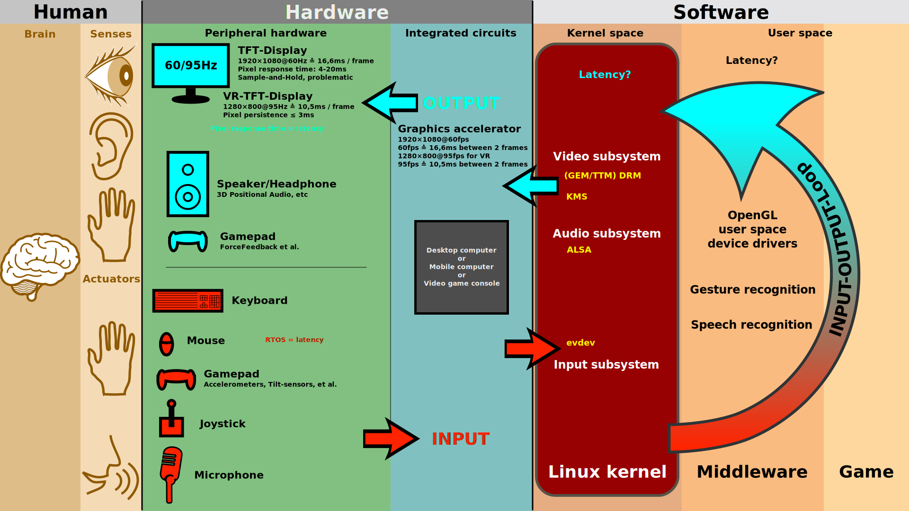

# Introduction to User Interface Design

## 💛 What is User Interface (UI)?

User Interface (UI) là giao diện người dùng, nghĩa là phần mà người dùng tương tác với một hệ thống hoặc ứng dụng. Nó đại diện cho tất cả các yếu tố mà người dùng có thể nhìn thấy, tương tác và sử dụng để thao tác với hệ thống đó.

UI bao gồm các thành phần như các nút bấm, ô nhập liệu, menu, thanh công cụ, hình ảnh, biểu đồ và các phần tử khác mà người dùng có thể tương tác trực tiếp. Mục đích chính của UI là cung cấp một cách tương tác dễ dàng và hiệu quả cho người dùng, giúp họ thực hiện các tác vụ và hoạt động trên hệ thống một cách thuận tiện.

## 💛 What is User Interface Design (UID)?

User Interface Design (Thiết kế giao diện người dùng) là quá trình tạo ra giao diện người dùng cho một hệ thống, ứng dụng hoặc sản phẩm. Nó liên quan đến việc thiết kế các yếu tố giao diện như cấu trúc, hình dạng, màu sắc, hình ảnh, văn bản và các phần tử tương tác khác để tạo ra một giao diện hấp dẫn, trực quan và dễ sử dụng cho người dùng.

(Mô tả giao diện giao tiếp giữa người dùng và Máy tính)

Mục tiêu của UID là làm cho trải nghiệm và tương tác của người dùng trở lên đơn giản và hiệu quả nhất

### 💥 Information Architecture

Information Architecture (IA) là quá trình thiết kế cấu trúc và tổ chức thông tin trong một hệ thống, ứng dụng, trang web hoặc giao diện người dùng. Nó tập trung vào việc xác định cách thông tin được tổ chức, đánh giá, hiển thị và tương tác để tạo ra một trải nghiệm người dùng tốt.

Nó tập trung diễn đặt vấn đề: Điều hướng, tổ chức bố cục, thành phần hiển thị. Mục tiêu làm sao cho người dùng trải nghiệm tốt nhất.

### 💥 Interaction Design

Interaction Design (ID) là quá trình thiết kế các yếu tố tương tác và trải nghiệm người dùng trong một hệ thống, ứng dụng hoặc sản phẩm. Nó tập trung vào việc xác định cách người dùng tương tác với giao diện và cung cấp trải nghiệm tốt nhất cho họ

5 khía cạnh của thiết kế tương tác

#### 🔹 Words - Từ ngữ

Từ ngữ – đặc biệt là những từ được sử dụng trong tương tác, như nhãn nút – phải có ý nghĩa, đơn giản và dễ hiểu. Chúng ta nên truyền đạt đủ và đúng thông tin cho người dùng, nhưng không quá nhiều thông tin để người dùng bị choáng ngợp.

#### 🔹 Visual Rep - Đại diện trực quan

Điều này liên quan đến các yếu tố đồ họa như hình ảnh, kiểu chữ và biểu tượng mà người dùng tương tác. Chúng thường bổ sung các từ được sử dụng để truyền đạt thông tin cho người dùng.

Nhìn vào cái biểu tượng thì người dùng hiểu ngay nó là gì, công năng sử dụng mà ko cần phải đi đọc hướng dẫn sử dụng.

#### 🔹 Object/Space - Đối tượng vật lý hoặc không gian

Người dùng tương tác với sản phẩm thông qua những đối tượng vật lý nào? Một máy tính xách tay, với một con chuột hoặc touchpad (bàn di chuột)? Hay một chiếc điện thoại thông minh, bằng ngón tay của người dùng? Và người dùng làm như vậy trong loại không gian vật lý nào? Ví dụ: người dùng đang đứng trong một đoàn tàu đông đúc trong khi sử dụng ứng dụng trên điện thoại thông minh hoặc đang ngồi trên bàn làm việc trong văn phòng để lướt trang web? Tất cả những điều này đều ảnh hưởng đến sự tương tác giữa người dùng và sản phẩm.

#### 🔹 Time - Thời gian

Mặc dù yếu tố thứ tư này nghe có vẻ hơi trừu tượng, nhưng nó chủ yếu đề cập đến các phương tiện thay đổi theo thời gian (hoạt ảnh, video, âm thanh). Chuyển động và âm thanh đóng một vai trò quan trọng trong việc đưa ra phản hồi bằng hình ảnh và âm thanh cho các tương tác của người dùng. Một vấn đề đáng quan tâm nữa là lượng thời gian người dùng dành để tương tác với sản phẩm: người dùng có thể theo dõi tiến trình của họ hoặc tiếp tục tương tác một thời gian sau không?

Bạn thấy rất nhiều trong các app học tiếng anh.

- Âm thanh khi làm đúng
- Âm thanh khi làm sai
- Hiệu ứng khi làm đúng, sai...

#### 🔹 Behavior - Hành vi

Điều này bao gồm cơ chế của một sản phẩm: làm thế nào để người dùng thực hiện các hành động trên trang web? Người dùng vận hành sản phẩm như thế nào? Nói cách khác, đó là cách các thứ nguyên trước đó xác định các tương tác của một sản phẩm. Hành vi cũng bao gồm các phản ứng, ví dụ: phản hồi hoặc hồi âm về cảm xúc của người dùng và sản phẩm.

### 💥 Visual Design  

Visual Design là quá trình tạo ra một giao diện hoặc trình bày hình ảnh hấp dẫn, trực quan và thẩm mỹ. Nó liên quan đến việc sắp xếp các yếu tố hình ảnh và màu sắc để tạo ra một trải nghiệm hình ảnh đồ họa tốt nhất và gửi thông điệp một cách hiệu quả.

Visual Design bao gồm các yếu tố sau:

1. Màu sắc: Lựa chọn màu sắc phù hợp để thể hiện thông điệp và tạo ra một thẩm mỹ hài hòa. Màu sắc có thể tạo ra sự tương phản, tạo điểm nhấn và tạo cảm xúc cho người xem.

2. Đồ họa: Sử dụng hình ảnh, biểu đồ, biểu đồ, biểu đồ, biểu đồ và các yếu tố hình ảnh khác để truyền đạt ý tưởng, thông tin và tạo ra sự hấp dẫn. Đồ họa có thể được sử dụng để tạo ra các yếu tố như logo, biểu ngữ, hình ảnh nền và biểu đồ.

3. Kiểu chữ: Lựa chọn phông chữ phù hợp để tạo ra một hình ảnh chữ viết đồng nhất và phù hợp với thông điệp và phong cách tổng thể. Kiểu chữ có thể tạo ra cảm giác chuyên nghiệp, thân thiện, truyền cảm hứng hoặc nổi bật.

4. Bố cục: Sắp xếp các yếu tố hình ảnh và văn bản một cách hợp lý trong không gian để tạo ra một giao diện hoặc trình bày hấp dẫn và dễ đọc. Bố cục cũng tạo ra sự cân đối, sự cân đối và sự tổ chức cho các yếu tố trong bức tranh tổng thể.

5. Hiệu ứng hình ảnh: Sử dụng các hiệu ứng hình ảnh như ánh sáng, mờ, đổ bóng, độ sáng và độ tương phản để tạo ra sự thú vị và tạo ra sự chuyển động trong hình ảnh.

---

Visual Design phù hợp cho từng loại đối tượng

- Người già
- Trẻ em

Visual Design phù hợp cho từng loại hình dịch vụ

- Bất động sản
- Chính phủ
- Game
- Xem Phim
- Mua sắm

---

## 💛 Parts of User Interface Design?

### 💥 Input Controls

- Button
- Radio
- Checkbox
- Select
- Input

### 💥 Navigation Components

- Search field
- Breadcrumb
- Pagination
- Tags
- Icons
- Image Carousel

### 💥 Information Components

- Tooltip
- Notification
- Process bar
- Message box
- Modal (Popup)

### 💥 Containers

- Accordion

---

## 💛 Dialogues/Principles and Attributes of User Interface Design

Những nguyên tắc trong thiết kiêu UI (UI Principles)

### 💥 Structure

### 💥 Simplicity

### 💥 Visibility

### 💥 Feedback

### 💥 Torelance

### 💥 Reuse

Bạn có thể search với keyword: `Principles User Interface Design` để tìm hiểu rõ hơn về khái niệm này.

---

## 💛 Types of User Interfaces

Các loại hình UI

### 💥 command line interface (CLI)

Command Line Interface (CLI) là một hình thức giao diện người dùng cho phép người dùng tương tác với hệ thống, ứng dụng hoặc thiết bị thông qua việc nhập lệnh văn bản vào dòng lệnh hoặc cửa sổ dòng lệnh. Trong CLI, người dùng phải gõ các lệnh và tham số liên quan để thực hiện các tác vụ và hoạt động

- Command line (Window)
- Terminal (Unix, Linux và macOS)

### 💥 graphical user interface (GUI)

Graphical User Interface (GUI) là một hình thức giao diện người dùng sử dụng hình ảnh đồ họa và các phần tử tương tác để tương tác với một hệ thống, ứng dụng hoặc thiết bị điện tử. Nó cung cấp một giao diện đồ họa dễ sử dụng và trực quan cho người dùng, cho phép họ thao tác và tương tác với các chức năng và tính năng của hệ thống thông qua các phần tử hình ảnh và điều khiển.

GUI bao gồm các yếu tố sau:

1. Cửa sổ: Hệ thống GUI chia màn hình thành các cửa sổ riêng biệt, mỗi cửa sổ chứa nội dung hoặc chức năng cụ thể. Các cửa sổ có thể được di chuyển, thay đổi kích thước và xếp chồng lên nhau.

2. Đồ họa: GUI sử dụng các yếu tố hình ảnh, biểu đồ, biểu đồ và biểu đồ để hiển thị thông tin và truyền đạt ý nghĩa cho người dùng. Đồ họa giúp tạo ra một giao diện trực quan và hấp dẫn.

3. Các điều khiển: GUI cung cấp các điều khiển tương tác như nút bấm, hộp chọn, ô nhập liệu, thanh trượt và menu để người dùng có thể tương tác và thực hiện các hành động.

4. Hình ảnh: GUI sử dụng hình ảnh và biểu tượng để đại diện cho các chức năng, tác vụ và đối tượng. Sử dụng các biểu tượng giúp người dùng dễ dàng nhận biết và hiểu các chức năng và hành động một cách nhanh chóng.

5. Đa phương tiện: GUI hỗ trợ hiển thị và phát lại nội dung đa phương tiện như hình ảnh, âm thanh và video. Điều này cho phép người dùng trải nghiệm các nội dung đa phương tiện trực quan và tương tác.

GUI ==> Giao diện trực quan

### 💥 menu-driven user interface

Menu-driven User Interface (UI) là một hình thức giao diện người dùng trong đó người dùng tương tác với hệ thống hoặc ứng dụng thông qua các menu và lựa chọn được cung cấp. Thay vì phải gõ các lệnh hoặc câu lệnh văn bản, người dùng có thể điều hướng và thực hiện các tác vụ bằng cách chọn từ danh sách các tùy chọn được hiển thị trên màn hình

Menu-driven UI thường được sử dụng trong các ứng dụng
- Máy tính, phần mềm
- điện thoại di động, máy tính bảng
- iPods
- Recorder
- Máy ATM, Máy bán vé tự động

### 💥 touch user interface

Touch User Interface (TUI) là một hình thức giao diện người dùng cho phép người dùng tương tác với một hệ thống, thiết bị hoặc ứng dụng bằng cách sử dụng cử chỉ và chạm trên một màn hình cảm ứng. TUI cho phép người dùng điều khiển và tương tác với các yếu tố trên màn hình bằng cách sử dụng ngón tay hoặc công cụ cảm ứng khác.

- Điện thoại
- Pos tự động
- Máy tra cứu thông tin ở sân bay, bảo tàng

### 💥 voice user interface (VUI)

Voice User Interface (VUI) là một hình thức giao diện người dùng cho phép người dùng tương tác với hệ thống, thiết bị hoặc ứng dụng bằng giọng nói. VUI sử dụng công nghệ nhận dạng giọng nói để hiểu và diễn giải các lệnh và câu hỏi được phát ra bằng giọng nói từ người dùng.

Thấy ở các thiết bị thông minh có tích hợp tìm kiếm và ra lệnh bằng giọng nói: Tivi, thết bị có Trợ lý ảo Google, alexa...

### 💥 form-based user interface

Form-based User Interface (UI) là một hình thức giao diện người dùng trong đó người dùng tương tác với hệ thống hoặc ứng dụng bằng cách nhập thông tin vào các biểu mẫu (form). Đây là một phương thức phổ biến để thu thập thông tin từ người dùng và thực hiện các tác vụ liên quan

### 💥 natural language user interface

Natural Language User Interface (NUI) là một hình thức giao diện người dùng cho phép người dùng tương tác với hệ thống, thiết bị hoặc ứng dụng bằng ngôn ngữ tự nhiên, giống như cách người ta nói chuyện với nhau. NUI sử dụng công nghệ xử lý ngôn ngữ tự nhiên để hiểu và đáp ứng các câu lệnh, câu hỏi và yêu cầu từ người dùng

Các ví dụ của NUI bao gồm trợ lý ảo (như Siri, Google Assistant, Amazon Alexa), chatbot, hệ thống trả lời tự động và các ứng dụng hỗ trợ tương tác bằng giọng nói. NUI cung cấp một phương thức tương tác tự nhiên và thuận tiện cho người dùng, giúp họ tương tác với hệ thống một cách trực quan và thoải mái hơn.

## 💛 Processes in User Interface Design

### 💥 Step 1 - Interface Analysis

Phân tích giao diện

### 💥 Step 2 - Interface Design

Phân tích thiết kế

### 💥 Step 3 - Interface Construction / Implementation

Xây dựng / Triển khai giao diện

### 💥 Step 4 - Interface Evaluation

Đánh giá giao diện

## 💛 Models in User Interface Design

### 💥 User Model

Mô hình người dùng

### 💥 Mental Model

Mô hình tư duy

### 💥 Design Model

Mô hình thiết kế

### 💥 Implementation Model

Mô hình triển khai

## 💛 Principles of Mobile User Interface Design

Những nguyên tắc thiết kế giao diện Mobile

1. Content-First Approach: Tiếp cận nội dung đầu tiên
2. Importance of Fullscreen: Tầm quan trọng của việc hiện thị FullScreen
3. Avoiding Clutter: Tránh sự lộn xộn
4. Creating the First Impression: Tạo ấn tượng đầu tiên
5. Focusing on User: Tập trung vào người dùng 
6. Using Color Psychology: Sử dụng màu sắc theo tâm lý người dùng
7. HighResolution Images: Hình ảnh có độ phân giải cao

## 💛 Color Theory

Lý thuyết về Màu sắc

Tham khảo:

- https://www.w3schools.com/colors/colors_theory.asp
- https://www.interaction-design.org/literature/topics/color-theory#:~:text=Color%20theory%20is%20the%20study,right%20colors%20for%20their%20projects.

## 💛 Design Thinking

## 💛 Best Practices in UI Design

## 💛 Summary

