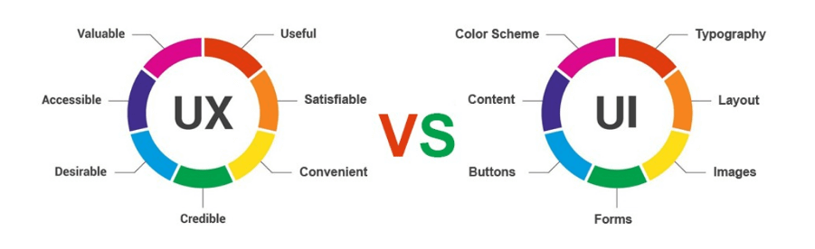
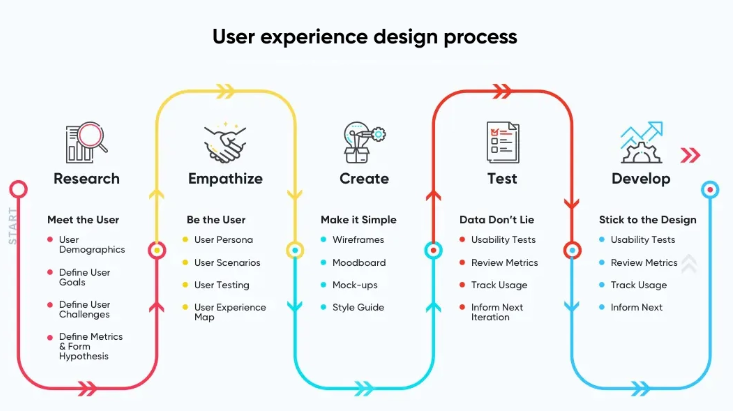
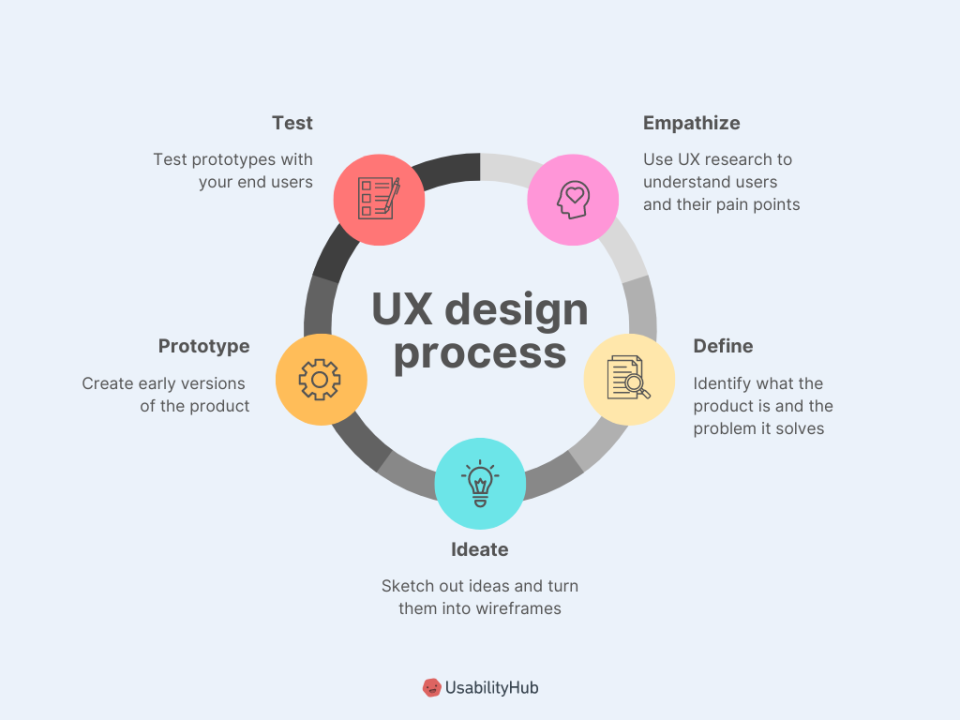
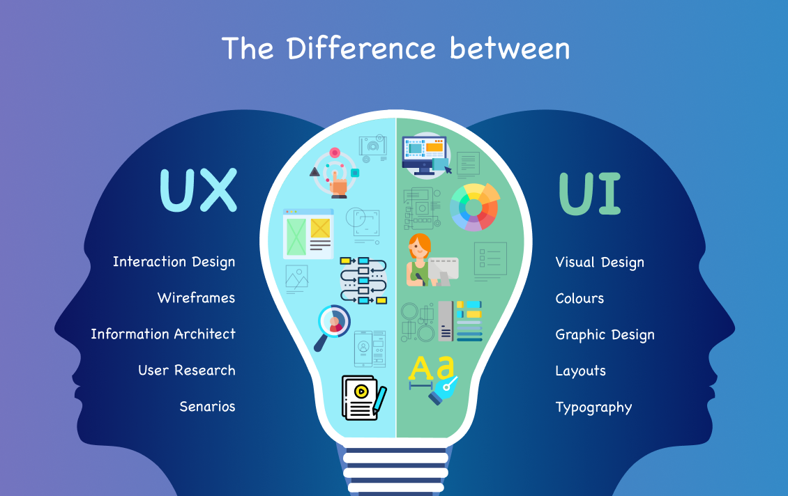
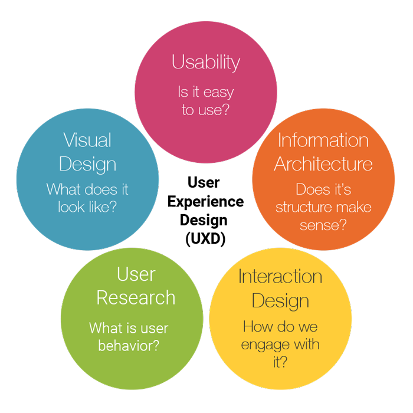
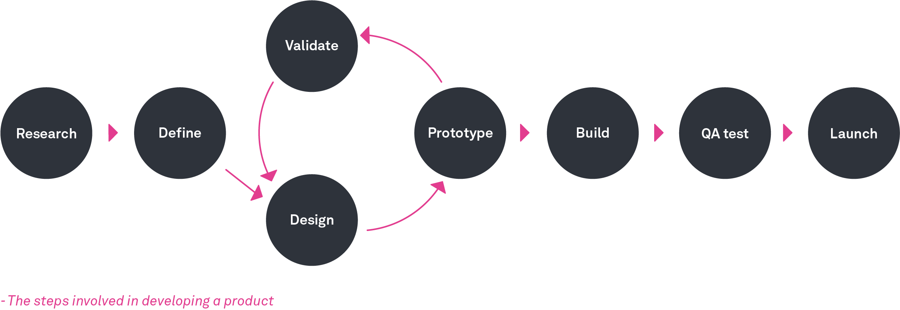

# Introduction to User Experience Design

## 💛 Definition of UX and UX Design

### 💥 User Experience (UX) ?

**User Experience** là thuật ngữ dùng để miêu tả trải nghiệm của người dùng khi họ tương tác với một sản phẩm, dịch vụ hoặc hệ thống. Nó tập trung vào việc nắm bắt cảm nhận, ý kiến và phản hồi của người dùng để tạo ra trải nghiệm tốt nhất có thể.

UX bao gồm nhiều yếu tố, bao gồm giao diện người dùng (user interface - UI), tương tác người dùng, thiết kế thông tin, khả năng truy cập và tinh gọn, hiệu suất, tiện ích và sự hài lòng của người dùng. Mục tiêu của UX là cung cấp một trải nghiệm tốt, dễ sử dụng và tương tác tốt cho người dùng, đồng thời đáp ứng được nhu cầu và mục tiêu của họ

Tham khảo: 

- https://www.qualtrics.com/de/erlebnismanagement/kunden/user-experience/

### 💥 UX Design ?

User Experience Design (UX Design) là `quá trình` thiết kế và tạo ra trải nghiệm người dùng tốt nhất có thể khi họ tương tác với một sản phẩm, dịch vụ hoặc hệ thống. Mục tiêu của UX Design là đảm bảo rằng người dùng có trải nghiệm dễ sử dụng, hài lòng và ý nghĩa.

Trong quá trình UX Design, các nhà thiết kế sẽ nghiên cứu và hiểu về người dùng, yêu cầu và mục tiêu của họ. Họ sẽ thực hiện các hoạt động như nghiên cứu thị trường, phân tích người dùng, tạo personas (hình tượng người dùng đại diện), và xác định các khía cạnh quan trọng của trải nghiệm người dùng.

Dựa trên thông tin thu thập được, các nhà thiết kế sẽ tạo ra các khung nhìn (frameworks) và nguyên mẫu (prototypes) để hiển thị giao diện và tương tác của sản phẩm. Họ sẽ tiến hành thử nghiệm và thu thập phản hồi từ người dùng để điều chỉnh và cải thiện sản phẩm.

Các yếu tố quan trọng trong UX Design bao gồm:

1. Nghiên cứu người dùng: Hiểu rõ về người dùng, nhu cầu, mục tiêu, và ngữ cảnh sử dụng sản phẩm.

2. Thiết kế thông tin: Tạo ra cấu trúc thông tin rõ ràng và dễ hiểu để người dùng tìm kiếm và tương tác dễ dàng.

3. Giao diện người dùng (UI Design): Xây dựng giao diện hấp dẫn, thân thiện và dễ sử dụng cho người dùng.

4. Tương tác người dùng: Thiết kế các phản hồi và tương tác mà người dùng có thể tương tác với sản phẩm một cách tự nhiên và thuận tiện.

5. Kiểm tra và thử nghiệm: Tiến hành kiểm tra, thử nghiệm và thu thập phản hồi từ người dùng để cải thiện trải nghiệm người dùng.

UX Design là một quá trình liên tục và đòi hỏi sự tương tác giữa các chuyên gia UX, nhà phát triển và người dùng để đảm bảo rằng sản phẩm cuối cùng đáp ứng được mong đợi và yêu cầu của người dùng.

Tham khảo:

- https://www.netsolutions.com/insights/user-experience-design-is-hard-to-get-right/
- https://www.lyssna.com/blog/what-is-user-experience-design/

## 💛 Difference Between UI and UX ?

UI (User Interface) và UX (User Experience) là hai thuật ngữ liên quan đến thiết kế trải nghiệm người dùng, nhưng chúng có ý nghĩa và phạm vi khác nhau:

1. User Interface (UI):
UI (User Interface) là phần của sản phẩm, dịch vụ hoặc hệ thống mà người dùng tương tác trực tiếp. Nó bao gồm các yếu tố như giao diện đồ họa, đồ họa bạn dùng, các nút, biểu tượng, màu sắc, bố cục, hình ảnh, và các yếu tố trực quan khác mà người dùng nhìn thấy và tương tác trên màn hình. UI thiết kế nhằm tạo ra một giao diện hấp dẫn, thân thiện và dễ sử dụng cho người dùng.

2. User Experience (UX):
UX (User Experience) là tổng thể trải nghiệm của người dùng khi tương tác với sản phẩm, dịch vụ hoặc hệ thống. Nó bao gồm cảm nhận, đánh giá và ý kiến của người dùng về sản phẩm. UX Design nhằm tạo ra một trải nghiệm tốt nhất có thể bằng cách nghiên cứu người dùng, thiết kế thông tin, tương tác người dùng và các yếu tố khác để đáp ứng các nhu cầu, mục tiêu và mong đợi của người dùng.

Điểm khác nhau chính giữa UI và UX là:

- UI: Tập trung vào thiết kế giao diện người dùng, bao gồm các yếu tố trực quan trên màn hình.
- UX: Tập trung vào tổng thể trải nghiệm người dùng, bao gồm cảm nhận, đánh giá và ý kiến của người dùng.

## 💛 Elements of User Experience Design

## 💛 Significance of User Experience

Tầm quan trọng của trải nghiệm người dùng

User Experience (UX) có ý nghĩa quan trọng vì nó ảnh hưởng đến sự thành công của một sản phẩm, dịch vụ hoặc hệ thống trong việc đáp ứng nhu cầu và mong đợi của người dùng. Dưới đây là một số điểm quan trọng về tầm quan trọng của User Experience:

1. Tạo sự hài lòng của người dùng: Một trải nghiệm người dùng tốt giúp tạo ra sự hài lòng và sự hứng thú khi sử dụng sản phẩm hoặc dịch vụ. Điều này giúp tăng khả năng người dùng tiếp tục sử dụng và tin tưởng vào sản phẩm của bạn.

2. Tăng tương tác và tham gia: Một giao diện người dùng dễ sử dụng và hấp dẫn tạo ra một môi trường thuận tiện để người dùng tương tác và tham gia. Khi người dùng có trải nghiệm tích cực, họ có xu hướng tương tác nhiều hơn, tạo ra phản hồi và đóng góp cho cộng đồng hoặc nền tảng sử dụng.

3. Tăng khả năng tiếp thị và cạnh tranh: Một trải nghiệm người dùng tốt giúp tạo ra một ấn tượng tích cực với khách hàng và người dùng tiềm năng. Điều này có thể tăng khả năng tiếp thị của sản phẩm hoặc dịch vụ và tạo ra lợi thế cạnh tranh trong thị trường.

4. Giảm chi phí hỗ trợ và bảo trì: Khi một sản phẩm hoặc dịch vụ có một trải nghiệm người dùng tốt, người dùng có thể dễ dàng sử dụng và hiểu cách hoạt động. Điều này giúp giảm thiểu nhu cầu hỗ trợ và giao dịch về bảo trì, giúp tiết kiệm chi phí cho doanh nghiệp.

5. Xây dựng lòng trung thành và đánh giá tích cực: Một trải nghiệm người dùng tốt tạo ra lòng trung thành từ người dùng và có thể dẫn đến việc đánh giá tích cực và chia sẻ với người khác. Điều này có thể tạo ra tác động tích cực đến hình ảnh và danh tiếng của doanh nghiệp.

Tóm lại, User Experience không chỉ tạo ra một trải nghiệm tốt cho người dùng mà còn có tác động rất lớn đến sự thành công và phát triển của một sản phẩm hoặc dịch vụ. Nó giúp tạo ra sự hài lòng, tăng tương tác, tăng khả năng tiếp thị và cạnh tranh, giảm chi phí hỗ trợ và xây dựng lòng trung thành từ người dùng.

## 💛  Principles of User Experience Design

Nhưng nguyên tắc trong thiết kế trải nghiệm người dùng

Các nguyên tắc của Thiết kế Trải nghiệm Người dùng là những hướng dẫn và quy tắc cơ bản được áp dụng trong quá trình thiết kế trải nghiệm người dùng để đảm bảo rằng sản phẩm hoặc dịch vụ đáp ứng được nhu cầu và mong đợi của người dùng. Dưới đây là một số nguyên tắc quan trọng trong lĩnh vực này:

1. Nguyên tắc đặt người dùng lên hàng đầu (User-Centric):

Nguyên tắc này đặt người dùng là trung tâm của quá trình thiết kế. Điều quan trọng là hiểu và đáp ứng nhu cầu, mục tiêu, khả năng và giới hạn của người dùng. Thiết kế phải tạo ra trải nghiệm thúc đẩy sự hài lòng và tương tác tích cực của người dùng.

2. Nguyên tắc đơn giản hóa (Simplicity):

Nguyên tắc này nhấn mạnh sự đơn giản và dễ sử dụng trong giao diện người dùng. Thiết kế nên loại bỏ sự phức tạp không cần thiết và tạo ra một trải nghiệm người dùng trực quan, dễ hiểu và dễ tiếp cận.

3. Nguyên tắc nhất quán (Consistency):

Nguyên tắc này đảm bảo rằng giao diện người dùng có tính nhất quán trong cả cấu trúc, hành vi và thiết kế. Sự nhất quán giữa các phần của sản phẩm hoặc dịch vụ tạo ra sự dễ nhìn và dễ sử dụng cho người dùng.

4. Nguyên tắc trực quan (Visual):

Nguyên tắc này tập trung vào việc sử dụng yếu tố trực quan như màu sắc, hình ảnh, biểu đồ và phông chữ để tạo ra một giao diện hấp dẫn và dễ nhìn. Sự sắp xếp hợp lý và sự cân nhắc về mặt thẩm mỹ cũng là một phần quan trọng của nguyên tắc này.

5. Nguyên tắc tương tác (Interactive):

Nguyên tắc này đảm bảo rằng giao diện người dùng cung cấp các phản hồi và tương tác cho người dùng. Các yếu tố tương tác như nút bấm, liên kết, điều hướng và hành động người dùng nên được thiết kế một cách rõ ràng và dễ hiểu.

6. Nguyên tắc độ tin cậy (Trustworthiness):

Nguyên tắc này liên quan đến việc tạo ra một cảm giác tin cậy và đáng tin cậy đối với người dùng. Thiết kế nên tạo ra một môi trường an toàn, bảo mật và đáng tin cậy để người dùng cảm thấy thoải mái trong việc sử dụng sản phẩm hoặc dịch vụ.

7. Nguyên tắc rõ ràng (Clarity):

Nó tập trung vào việc tạo ra một giao diện người dùng mà người dùng có thể hiểu và tương tác một cách dễ dàng và rõ ràng mà không cần học cách sử dụng.

>Xem thêm: https://www.uxdesigninstitute.com/blog/ux-design-principles/

## 💛 User Experience Design Process

Quá trình được lặp đi lặp lại cho đến khi đưa vào vận hành.

