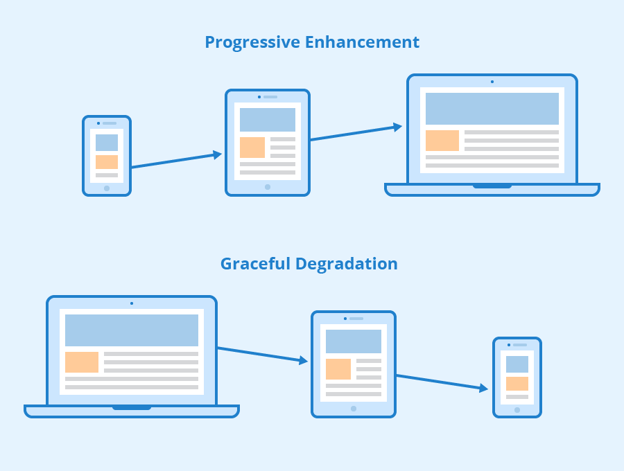

# Understanding Responsive Web Design

Tìm hiểu cơ chế hoạt động của một website có tính năng Responsive.

## 💛 What is Responsive User Interface Design ?

**Responsive User Interface Design** là một phương pháp thiết kế web trong đó giao diện thích ứng với bố cục của thiết bị để tăng cường khả năng sử dụng, điều hướng và tìm kiếm thông tin. Sự linh hoạt này có thể nhờ vào các `media queries`, cho phép thiết kế tự động điều chỉnh để phù hợp với không gian trình duyệt và đảm bảo tính nhất quán của nội dung trên các thiết bị, cũng như các yếu tố thiết kế được định kích cỡ bằng đơn vị tương đối (%).

### 💥 Lợi ích mang lại cho người dùng

- Điều hướng mượt mà
- Đọc dễ dàng, không bị mất nội dung
- Giảm thao tác cuộn, thu phóng
- Tăng trải nghiệm người dùng


## 💛 Fundamental Techniques for RWD ?

Các kỹ thuật triển khai

### 💥 CSS3 Media Queries and Screen Resolutions

```css
/* Màn hình tối thiểu 769px thì màu trắng */
@media only screen and (min-width: 769px) {
  body {
    background-color: #fff;
  }
}
/* Màn hình tối đa 768px thì màu lightblue */
@media only screen and (max-width: 768px) {
  body {
    background-color: lightblue;
  }
}
/* Màn hình tối đa 457px thì màu orange */
@media only screen and (max-width: 457px) {
  body {
    background-color: orange;
  }
}
```


Xem thêm: https://www.w3schools.com/css/css_rwd_mediaqueries.asp

### 💥 Flexible images

Đối với hình ảnh. Tùy vào từng trường hợp cụ thể.

Còn hẫu hết để hình ảnh tương thích được với các kích thước màn hình khác nhau thì bạn cần cho nó một thuộc tính

```css
img{
    max-width: 100%,
    height: auto
}
```
Xem thêm: https://www.w3schools.com/css/css_rwd_images.asp


### 💥 Fluid, Proportion-based Grids

Grids trong thiết kế website responsive là cách thức chia nội dung theo trục ngang thành các cột nhỏ thông thường là 12 cột (Column Grid).

Dựa vào các cột này. Người ta bố trí nội dung nằm ở đâu trong 12 cột đó.

Xem thêm: https://www.w3schools.com/css/css_rwd_grid.asp


Giới thiệu về 2 thư viện hỗ trợ phổ biến: 

#### Bootstrap 5

Doc: https://getbootstrap.com/

#### TailwindCss

Doc: https://tailwindcss.com/


## 💛 What is Progressive Enhancement?

- Giao diện người dùng có thể được cấu hình từ 3 lớp  (layer)

.svg)

- Base cơ bản dựa trên HTML, CSS là chủ yếu

- Ngoài ra chúng ta có thể sử dụng lớp JS để can thiệp vào kết quả hiển thị. Ví dụ: Thêm mới, Xóa, Cập nhật... dẫn đến thay đổi kết quả hiển thị.


## 💛 Difference Between Graceful Degradation and Progressive Enhancement




### 💥 Graceful Degradation

**Graceful Degradation** là một triết lý thiết kế tập trung vào việc xây dựng một website/ứng dụng tập trung vào các thiết bị màn hình lớn (Desktop) làm cốt lõi.

Nhưng khi người dùng sử dụng các thiết bị có kích thước màn hình nhỏ hơn (Tablet, Mobile) thì vẫn hỗ trợ bằng cách hiển thị đáp ứng (repsonsive).  Mục tiêu là đảm bảo rằng người dùng cuối cùng vẫn có thể truy cập và sử dụng nội dung hoặc chức năng cốt lõi, mặc dù họ có thể không nhận được trải nghiệm tốt nhất như trên Desktop

### 💥 Progressive Enhancement

Đơn giản bạn chỉ cần hiểu nó ngược lại.

---

Nhưng trên thực tế người ta sử dụng song song 2 phương pháp. Để nó bổ sung cho nhau. Suy cho cùng thì Mục tiêu là phải tăng tính trải nghiệm người dùng.

## 💛 Responsive Work Design Workflow

Quy trình triển khai thiết kế Responsive


### 💥 1. Discover

### 💥 2. Designer

### 💥 3. Develop

### 💥 4. Deploy
