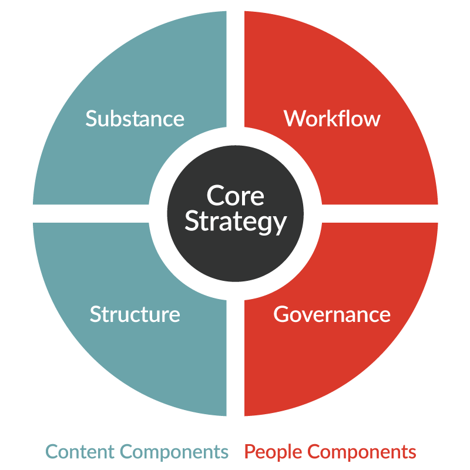

# Understanding Strategies for Responsive Web Design

## 💛 Strategies for RWD in Various Devices

Chiến lược cho việc RWD trên nhiều thiết bị khác nhau

### 💥 1. Identifying breakpoints

Xác định các điểm breakpoints hỗ trợ

### 💥 2. Lowering page load time

Giảm thời gian tải trang

### 💥 3. Optimizing image size

Tối ưu hóa kích thước hình ảnh

- Hình ảnh vừa đủ để hiển thị tại ví trí đó
- Nén hình tới mức vừa đủ chất lượng để hiển thị, để có dung lượng nhẹ nhất có thể.

### 💥 4. Mobile First

Ưu tiên mobile trước

### 💥 5. Research First

**Research first** (nghiên cứu trước) là một phương pháp tiếp cận trong đó nhà phát triển hoặc nhà thiết kế sẽ tiến hành nghiên cứu kỹ lưỡng trước khi bắt đầu quá trình thiết kế.

Nghiên cứu này có thể bao gồm việc tìm hiểu về người dùng mục tiêu, công nghệ họ sử dụng, cách họ tương tác với website hoặc ứng dụng, và các yếu tố khác có thể ảnh hưởng đến trải nghiệm của họ. Thông tin thu được từ quá trình nghiên cứu này sau đó sẽ được sử dụng để hướng dẫn quá trình thiết kế, giúp đảm bảo rằng sản phẩm cuối cùng sẽ đáp ứng nhu cầu và kỳ vọng của người dùng một cách hiệu quả.

## 💛 What is Content Strategy?

Trọng tâm là chiến lược nội dung cốt lõi, cách tiếp cận bạn sẽ thực hiện với nội dung trang web, sản phẩm hoặc dịch vụ của mình để đáp ứng nhu cầu của người dùng và đạt được mục tiêu kinh doanh của bạn. Để đạt được chiến lược đó một cách hiệu quả nhất, chúng tôi xem xét bốn thành phần có liên quan chặt chẽ với nhau

### 💥 Content-focused components

Các thành phần tập trung vào nội dung

- Substance (Nội dung): Chúng ta cần loại nội dung nào (chủ đề, loại, nguồn, v.v.) và nội dung cần truyền tải thông điệp gì đến khán giả?
- Structure (Cấu trúc): Nội dung được ưu tiên, sắp xếp, định dạng và hiển thị như thế nào? (Cấu trúc có thể bao gồm lập kế hoạch truyền thông, IA, siêu dữ liệu, mô hình hóa dữ liệu, chiến lược liên kết, v.v.)

### 💥 People-focused components

Các thành phần tập trung vào con người

- Workflow (Quy trình làm việc): Cần có những quy trình, công cụ và nguồn nhân lực nào để các sáng kiến nội dung có thể triển khai thành công và duy trì chất lượng liên tục?
- Governance (Quản trị): Các quyết định quan trọng về nội dung và chiến lược nội dung được thực hiện như thế nào? Những thay đổi được bắt đầu và truyền đạt như thế nào?

## 💛 How Does Content Strategy Relate to UX Design?

Chiến lược nội dung liên quan đến thiết kế UX như thế nào ?

Xem thêm: https://uxmag.com/articles/content-strategy-and-ux-a-modern-love-story