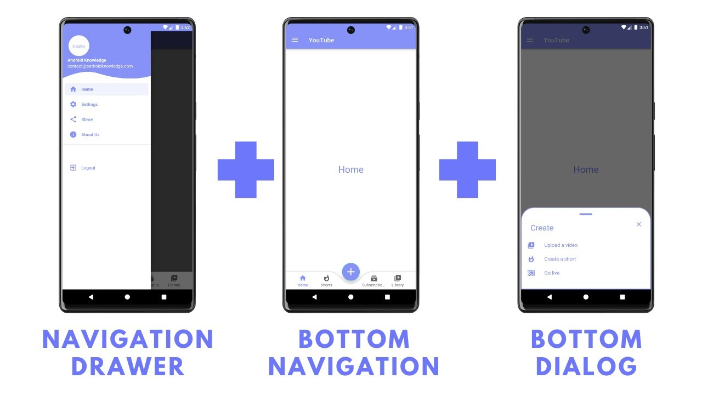

# Using Common RWD Patterns in Mobile Designs

## 💛 Breakpoints

Trong thiết kế giao diện web phản hồi (Responsive Web Design), **Breakpoint** là những điểm - vị trí mà ở đó sẽ tạo nên những thay đổi về giao diện - bố cục website. Những điểm này thường dùng để xác định kích thước các thiết bị dựa vào độ phân giải màn hình của chúng (VD như PC, Tablet và Mobile)

Xem thêm: https://www.w3schools.com/css/css_rwd_mediaqueries.asp

## 💛 Navigation Drawer

Thông thường có 3 loại.

Xem thêm: https://m2.material.io/components/navigation-drawer#standard-drawer

## 💛 Stacked Pagination

Thuật ngữ này được gọi là phân trang xếp chồng (Hay còn gọi là load more)

## 💛 Fluid Images

Cách thức co giản hình ảnh theo độ rộng của vùng hiển thị. 